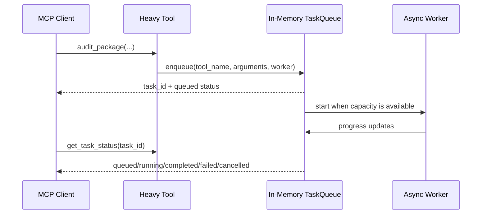
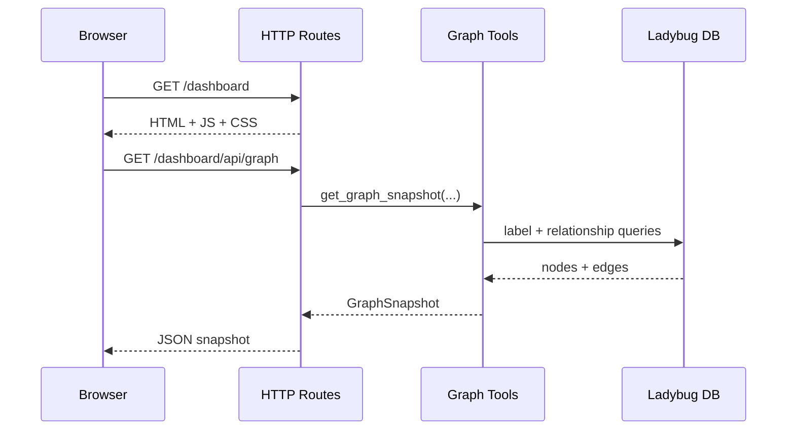
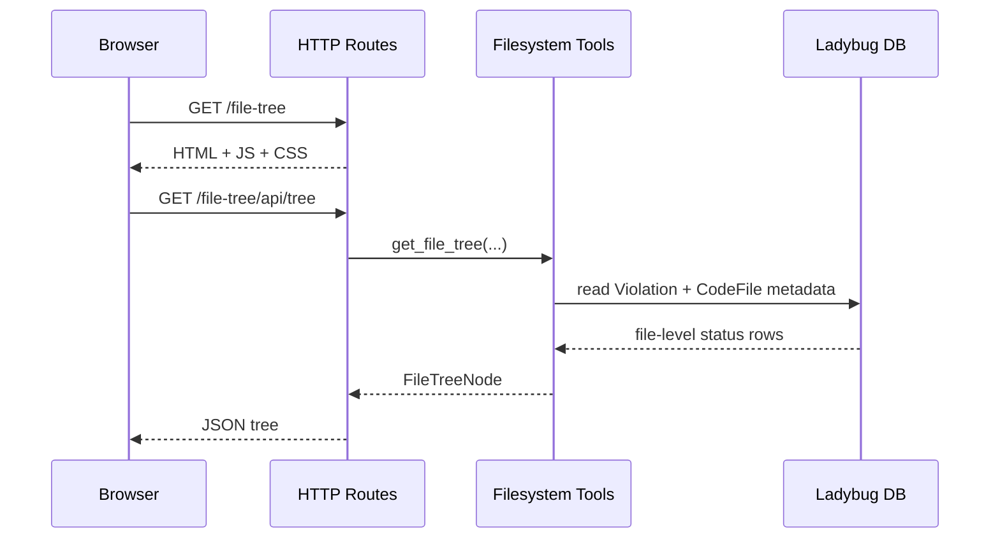
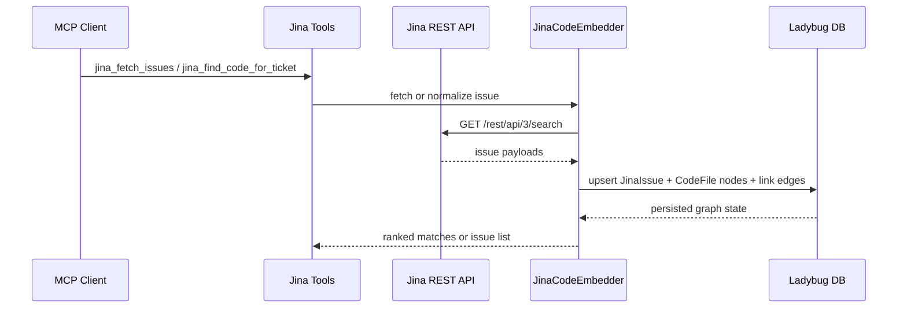
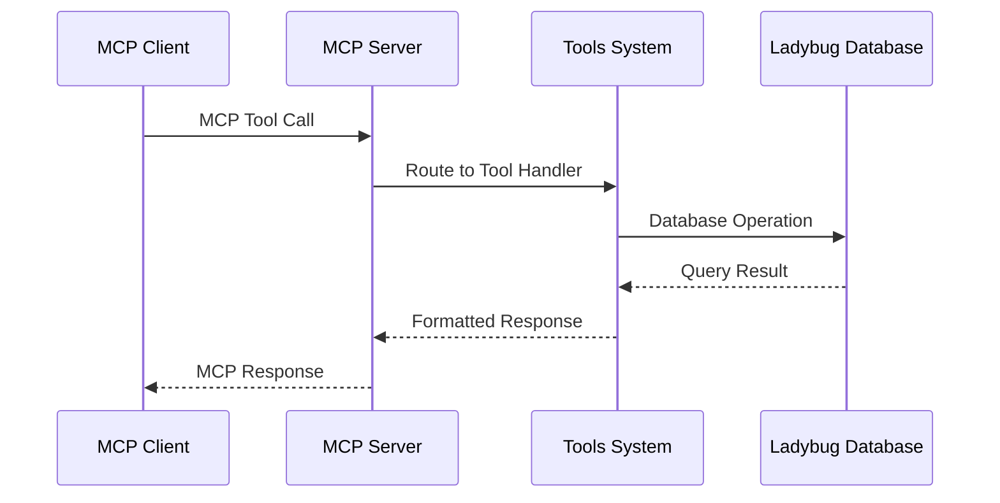
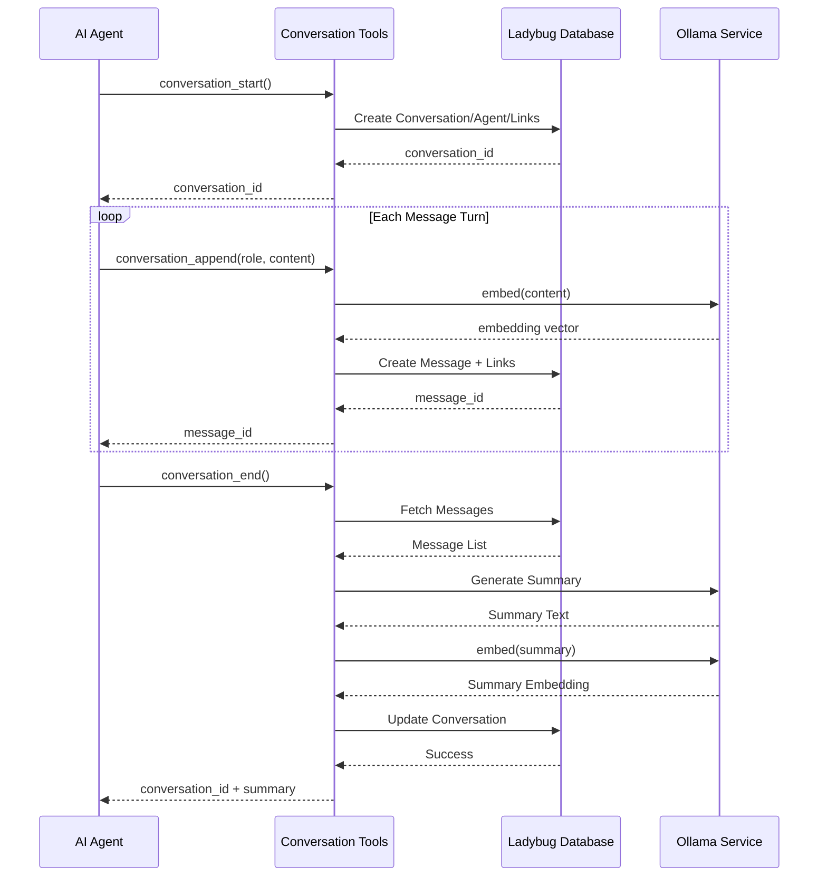
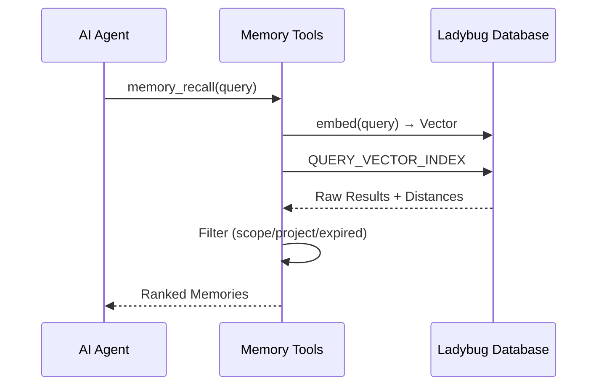

# Architecture Overview

## Purpose
This document provides a comprehensive architectural overview of the Syntx Memory MCP Server, showing how the server, tools, and agent components interact, their respective responsibilities, data flows, and external dependencies.

## System Overview
The Syntx Memory MCP Server is a Model Context Protocol (MCP) implementation designed to provide persistent memory and contextual awareness for AI agents. It combines a graph database backend with specialized tools for capturing and recalling various types of work artifacts.

Recent additions include an in-memory background task queue for long-running audit workflows, a lightweight HTTP dashboard for visual graph inspection, a file explorer surface, and a read-only Jina embedder that links issues to code files.

### High-Level Components
```
┌─────────────────┐    ┌──────────────────┐    ┌────────────────────┐
│   MCP Client    │◄──►│   MCP Server     │◄──►│   Agent System     │
│ (IDE, Editor,   │    │ (src/server.py)  │    │ (src/agents/)      │
│  CLI, etc.)     │    │                  │    │                    │
└─────────────────┘    └─────────▲─────────┘    └──────────▲────────┘
                                │                          │
                                ▼                          ▼
                    ┌──────────────────┐            ┌──────────────────┐
                    │   Tools System   │            │   Database       │
                    │ (src/tools/)     │            │ (Ladybug DB)     │
                    │                  │            │                  │
                    └──────────────────┘            └──────────────────┘
```

## Component Responsibilities

### MCP Server (`src/mem-graph/server.py`)
**Responsibilities:**
- Provide MCP protocol interface (HTTP/SSE/stdio transports)
- Manage server lifecycle (startup/shutdown via lifespan)
- Mount and organize tool sub-servers
- Implement tool discovery and lazy namespace activation
- Handle database connection initialization/cleanup
- Provide Ollama integration for embeddings and summarization
- Expose the dashboard HTTP routes and graph JSON APIs
- Coordinate the in-memory background task queue lifecycle

**Key Features:**
- Two-tier tool visibility (core always visible, namespaces session-activated)
- Tag-based component enabling/disabling
- Automatic ToolListChangedNotifications for dynamic tool updates
- Multi-protocol support (streamable HTTP and SSE)

### Tools System (`src/mem-graph/tools/`)
**Responsibilities:**
- Implement domain-specific functionality (memory, tasks, conversations, etc.)
- Provide semantic search capabilities via vector embeddings
- Manage data persistence through Ladybug graph database
- Expose FastMCP sub-servers that get mounted by main server
- Handle tool-specific business logic and data validation
- Provide queue-backed status polling and graph-visualization APIs

**Organization:**
- Each tool module exposes a `FastMCP` instance named `mcp`
- Tools are mounted in server.py via `mcp.mount(tool_module.mcp)`
- Lazy namespace tools use `tags={"namespace:<name>"}` for visibility control
- Core tools have no special tags (always visible)

### Agent System (`src/mem-graph/agents/`)
**Responsibilities:**
- Encapsulate autonomous decision-making and workflow execution
- Interact with MCP server through tool interfaces
- Maintain working memory and context during task execution
- Perform complex operations requiring reasoning and planning

**Current Implementation:**
- Audit Agent for codebase auditing and guideline evolution
- Built with Pydantic AI framework
- Uses typed dependencies and structured outputs
- Capable of invoking MCP-exposed tools

## Data Flows

### Tool Invocation Flow
[← src/mem-graph/server.py:66-94 - Mounting tools]
```
1. Client Request (MCP Protocol)
   ↓
2. FastMCP Routing (based on tool name)
   ↓
3. Tool Handler Execution (src/mem-graph/tools/*.py)
   ↓
4. Database Access (src/mem-graph/db.py:get_conn)
   ↓
5. Ladybug Operations (Cypher queries)
   ↓
6. Result Serialization
   ↓
7. Client Response (MCP Protocol)
```

### Background Task Flow


### Dashboard Flow


### File Explorer Flow


### Jina Linking Flow


### Conversation Capture Flow
[← src/mem-graph/tools/conversation.py:46-102 - conversation_start]
[← src/mem-graph/tools/conversation.py:105-191 - conversation_append]
[← src/mem-graph/tools/conversation.py:194-247 - conversation_end]
```
1. conversation_start:
   - Create Conversation node
   - Upsert Agent node
   - Link Project → Conversation
   - Link Agent → Conversation

2. conversation_append (per message):
   - content → embed() → Message node
   - Link Conversation → Message (with position)
   - Chain Message → Message (NEXT_MESSAGE)
   - Increment turn_count

3. conversation_end:
   - Fetch all messages in order
   - Generate summary via Ollama
   - Store summary + embedding on Conversation
   - Set ended_at timestamp
```

### Semantic Recall Flow
[← src/mem-graph/tools/memory.py:91-140 - memory_recall]
```
1. query → embed() → query vector
2. CALL QUERY_VECTOR_INDEX('Memory', 'idx_memory_emb', $qvec, k)
3. Filter results (expired memories, scope/project)
4. Return ranked memories with distance scores
```

### Agent Interaction Flow
[← src/mem-graph/tools/audit.py:14-58 - audit_package]
[← src/mem-graph/agents/audit_agent.py:18-22 - audit_agent]
```
1. Client → audit_package tool (MCP)
   ↓
2. Audit Agent initialization with dependencies
   ↓
3. Agent executes internal tool workflow:
   - list_package_files → read_file (repeated)
   - Pattern analysis → new smell identification
   ↓
4. Agent calls MCP-exposed tools:
   - update_guide → update_registry (via tools)
   ↓
5. Tools persist changes to database/filesystem
   ↓
6. Agent returns validated result
   ↓
7. MCP tool returns result to client
```

## External Dependencies

### Runtime Dependencies
- **Ladybug** - Embedded graph database for data storage
- **Ollama** - Local LLM service for embeddings (nomic-embed-text) and summarization (llama3.2)
- **FastMCP** - Model Context Protocol framework
- **Pydantic AI** - Agent framework (for Audit Agent)
- **dotenv** - Environment variable loading

### Configuration Dependencies
Environment variables loaded from `.env` or system:
- `MCP_HOST` - Server bind address (default: 127.0.0.1)
- `MCP_PORT` - Server port (default: 9100)
- `MCP_TRANSPORT` - Transport protocol (http/stdio, default: http)
- `LADYBUG_DB_PATH` - Database file path (default: ./data/syntx_memory.lbug)
- `OLLAMA_CODE_EMBED_MODEL` / `OLLAMA_TEXT_EMBED_MODEL` - Embedding model names for code and text paths
- `OLLAMA_EMBED_DIM` - Embedding dimension (default: 768)
- `JINA_URL`, `JINA_USERNAME`, `JINA_TOKEN` - Read-only Jina integration credentials
- `JINA_PROJECT_KEY`, `JINA_MATCH_THRESHOLD`, `JINA_MAX_RESULTS`, `JINA_EMBEDDER_TTL_SECONDS` - Jina matching and fetch controls
- `MEM_GRAPH_FILE_TREE_ROOT` - Default root path for the file explorer when no explicit root or project repo_path is supplied

### Development Dependencies
- **pytest** - Testing framework
- **black** - Code formatting
- **ruff** - Linting
- **mypy** - Type checking

## Data Flow Diagrams

### Basic Tool Interaction


### Conversation Lifecycle


### Semantic Search Flow


## Communication Protocols

### MCP Protocol Support
The server supports multiple MCP transport mechanisms:
- **Streamable HTTP** (`/mcp` endpoint) - For Claude Code and similar clients
- **Server-Sent Events** (`/sse` endpoint) - For Anthropic Inspector and SSE-compatible clients
- **Standard I/O** (`stdio` transport) - For local process communication

### Message Formats
All MCP communications use JSON-RPC 2.0 format:
- Requests: `{jsonrpc: "2.0", id: <num>, method: "tools/call", params: {...}}`
- Responses: `{jsonrpc: "2.0", id: <num>, result: {...}}` or `{jsonrpc: "2.0", id: <num>, error: {...}}`
- Notifications: `{jsonrpc: "2.0", method: "notifications/<name>", params: {...}}`

### Tool Interface
Tools receive parameters as defined by their function signatures and return dict objects that get automatically serialized to MCP results.

### Dashboard HTTP Surface
- `/dashboard` - static dashboard shell
- `/dashboard.js` and `/dashboard.css` - dashboard assets
- `/dashboard/api/graph` - bounded graph snapshot JSON
- `/dashboard/api/node/{node_id}` - node details JSON
- `/dashboard/api/search` - bounded graph search JSON
- `/dashboard/api/styles` - stable node-style metadata

## Deployment Architecture

### Development Mode
```
Local Machine
├── MCP Client (IDE Plugin/Cli)
├── Syntx MCP Server (localhost:9100)
│   ├── HTTP/SSE Endpoints
│   ├── Ladybug DB (./data/)
│   └── Ollama Connection (localhost:11434)
└── Ollama Service (localhost:11434)
```

### Production Deployment
```
Load Balancer
    ↓
[ MCP Server Instance 1 ]
[ MCP Server Instance 2 ]
    ↓
Shared Storage
    ├── Ladybug DB (Network Volume)
    └── Ollama Cluster (External Service)
```

Note: Current implementation assumes single-instance operation with local Ollama. Horizontal scaling would require:
1. Shared database backend
2. Externalized Ollama service
3. Stateless server instances

## Security Boundaries
```
┌─────────────────────────────────────────────────────┐
│                                                     │
│  Trusted Environment (Server Host)                  │
│  ┌──────────────┐    ┌────────────────┐    ┌──────┐ │
│  │ MCP Client   │    │ MCP Server     │    │ Ollama │ │
│  │ (Same Host)  │◄──►│ (Localhost:9100)│◄──►│(Localhost:11434)│
│  └──────────────┘    └────────────────┘    └──────┘ │
│                                                     │
└─────────────────────────────────────────────────────┘
```
All components assumed to run on same trusted host. No authentication implemented in current version.

## Scalability Considerations

### Vertical Scaling
- Increase host resources (CPU, RAM, SSD)
- Optimize LadyDB configuration
- Tune Ollama model loading and concurrency

### Horizontal Scaling Limitations
Current architecture presents challenges for horizontal scaling:
1. **Database** - Ladybug is embedded; would need migration to client/server graph DB
2. **Ollama** - Currently assumes local instance; would need external service
3. **Server State** - Minimal in-memory state, but tool activation is session-based

### Potential Scaling Paths
1. Replace Ladybug with Neo4j or similar graph database
2. Externalize Ollama to dedicated service
3. Implement Redis-backed session storage for tool activation state
4. Deploy behind load balancer with sticky sessions

## Inter-Component Contracts

### Server → Tools Contract
- Server mounts all `mcp` attributes from tool modules
- Tools must expose a `FastMCP` instance named `mcp`
- Tools receive automatic database connection via `get_ctx()`
- Tools return dict objects for MCP serialization

### Tools → Database Contract
- All tools use `get_conn()` from `src/mem-graph/db.py`
- Database schema defined in `schema/agent_memory_schema.cypher`
- Standard node/relationship naming conventions
- Embedding property named `embedding` as `FLOAT[n]`

### Agent → Server Contract
- Agents interact exclusively through MCP-exposed tools
- No direct database access by agents
- Agent capabilities must be exposed via `@mcp.tool()` decorated functions
- Agents receive context through standard MCP mechanisms

## Assumptions and Open Questions

### Assumptions Confirmed by Code
1. Single-process server execution (no built-in clustering)
2. Local Ollama dependency for AI capabilities
3. Embedded Ladybug database for persistence
4. Session-based tool activation via namespace tags
5. UUIDv4 string identifiers for all entities
6. UTC timestamps for all temporal data
7. Tool parameters validated via Pydantic Field annotations
8. Error handling returns dict with "error" key for failures

### Open Questions Requiring Confirmation
1. **Multi-tenancy** - How would multiple isolated users/sessions be supported?
   - Current approach: Session-based tool activation
   - Alternative: User/project scoping in database queries

2. **Persistence Guarantees** - What are the durability commitments?
   - Ladybug appears to write-sync on transaction commit
   - No explicit WAL or backup mechanisms visible

3. **Observability** - How is production monitoring handled?
   - Current: stderr/stdout logging
   - Needed: Metrics, tracing, health endpoints

4. **Extension Mechanism** - How are new tool types added?
   - Current: Add module to src/mem-graph/tools/, mount in server.py
   - Alternative: Plugin/dynamic loading system

## References to Code
- Server mounting: `src/mem-graph/server.py:83-94`
- Tool interface: `src/mem-graph/tools/*.py` (all files)
- Database contract: `src/mem-graph/db.py`
- Schema definition: `schema/agent_memory_schema.cypher`
- Agent pattern: `src/mem-graph/agents/audit_agent.py`
- MCP protocol: FastMCP framework (external dependency)
