# Autopilot Remediation Graph

> **Workflow key:** `autopilot_graph` · **Profile:** LARGE · **Risk:** HIGH · **Reasoning:** ReAct-Challenge  
> **Task types:** `remediation`, `refactoring`, `bug_fix`  
> **Source module:** `mem_graph.workflows.runtime.orchestrator_runtime`

The Autopilot Remediation graph is a guard-driven, recursive remediation cycle. It begins by gathering
all relevant context, then drafts failing tests *before* touching any code (sentry-first discipline).
A separate fixer pass proposes functional changes; a scribe pass enforces coding standards. A
deterministic CLI guard gate decides whether the output is accepted or routes back for another cycle.
Successful runs are always persisted to the graph memory.

```mermaid
---
config:
  theme: base
  look: classic
  themeVariables:
    primaryColor: "#059669"
    primaryTextColor: "#ffffff"
    primaryBorderColor: "#047857"
    secondaryColor: "#34d399"
    tertiaryColor: "#d1fae5"
    lineColor: "#6b7280"
    edgeLabelBackground: "#f0fdf4"
    clusterBkg: "#ecfdf5"
    clusterBorder: "#10b981"
    fontFamily: "ui-monospace, monospace"
    fontSize: "13px"
    nodeBorder: "#047857"
    nodeTextColor: "#064e3b"
---
flowchart TD
    Start(["🚀 START\nOrchestrator receives task"]):::startEnd

    %% ── Phase 1: Context gathering ──────────────────────────────────────
    subgraph SG_CTX ["① Context Gathering  |  agent: mapper  |  tools: file_read, file_search"]
        direction TB
        context_gather["**context_gather**
        Query graph for active violations,
        architectural decisions, and the
        project context map.
        Pre-read all target files into memory.
        ─────────────────────────
        📦 artifacts: —
        🛠 tools: file_read, file_search"]:::stageNode
    end

    %% ── Phase 2: Sentry-first drafts ────────────────────────────────────
    subgraph SG_DRAFT ["② Sentry-First Drafting  |  agents: sentry → fixer → scribe"]
        direction TB
        sentry["**sentry**
        Draft *failing* tests before any
        production code is written.
        Locks the expected behaviour
        so implementation is driven by tests.
        ─────────────────────────
        📦 artifacts: sentry_tests
        🛠 tools: file_read"]:::stageNode

        logic_draft["**logic_draft**
        Fixer agent proposes minimal,
        targeted functional code changes
        that make the sentry tests pass.
        ─────────────────────────
        📦 artifacts: fixer_patches
        🛠 tools: file_read, file_edit, file_write"]:::stageNode

        style_draft["**style_draft**
        Scribe agent applies project coding
        standards, naming conventions, and
        linting fixes to the logic patches.
        ─────────────────────────
        📦 artifacts: styled_patches
        🛠 tools: file_read, file_edit"]:::stageNode

        sentry --> logic_draft
        logic_draft --> style_draft
    end

    %% ── Phase 3: Validation & Guard ─────────────────────────────────────
    subgraph SG_VALID ["③ Validation  |  deterministic CLI gate"]
        direction TB
        guard{"**guard**
        Run deterministic CLI checks:
        lint · type-check · unit tests.
        Decide: PASS or RETRY?
        ─────────────────────────
        📦 artifacts: validation_status"}:::decisionNode

        memory_sync["**memory_sync**
        Persist run outcome, patches applied,
        violations resolved, and audit trail
        to the graph memory store.
        ─────────────────────────
        📦 artifacts: final_notes
        🛠 tools: (graph write via MCP)"]:::stageNode
    end

    Finish(["✅ END\nTask complete — graph updated"]):::startEnd

    %% ── Edges ────────────────────────────────────────────────────────────
    Start --> context_gather
    context_gather --> sentry
    style_draft --> guard
    guard -. "↩ cycle N of max retry_cycles=3\n(LARGE profile)" .-> context_gather
    guard -- "✅ PASS" --> memory_sync
    memory_sync --> Finish

    %% ── Styling ──────────────────────────────────────────────────────────
    classDef startEnd fill:#064e3b,stroke:#059669,color:#ffffff,font-weight:bold,rx:20
    classDef stageNode fill:#ecfdf5,stroke:#10b981,color:#064e3b,text-align:left
    classDef decisionNode fill:#d1fae5,stroke:#059669,color:#064e3b,font-weight:bold

    style SG_CTX   fill:#f0fdf4,stroke:#10b981,stroke-width:2px,color:#065f46,font-weight:bold
    style SG_DRAFT fill:#f0fdf4,stroke:#10b981,stroke-width:2px,color:#065f46,font-weight:bold
    style SG_VALID fill:#f0fdf4,stroke:#10b981,stroke-width:2px,color:#065f46,font-weight:bold
```

## Stage Summary

| # | Stage | Agent | Key Tools | Artifacts |
|---|-------|-------|-----------|-----------|
| 1 | `context_gather` | mapper | file_read, file_search | — |
| 2 | `sentry` | sentry | file_read | sentry_tests |
| 3 | `logic_draft` | fixer | file_read, file_edit, file_write | fixer_patches |
| 4 | `style_draft` | scribe | file_read, file_edit | styled_patches |
| 5 | `guard` | — (CLI) | — | validation_status |
| 6 | `memory_sync` | chat | MCP graph write | final_notes |

## Profile Constraints (LARGE)

| Constraint | Value |
|------------|-------|
| `max_stages` | 10 |
| `fan_out_limit` | 6 parallel sub-agents |
| `retry_cycles` | 3 |
| `checkpoint_frequency` | every 3 stages |
| Sandbox memory | 2 GB |
| Sandbox CPUs | 4 |
| `exec_timeout_seconds` | 60 |
| `session_ttl_seconds` | 7200 |
| `retain_artifacts` | true |
