# Managed Sub-Agent Workflow

> **Workflow key:** `managed_workflow_graph` · **Profile:** LARGE · **Risk:** MEDIUM · **Reasoning:** ReAct-Challenge  
> **Task types:** `subagent_workflow`, `managed_workflow`  
> **Source module:** `mem_graph.workflows.runtime.managed_workflow_runtime`

The Managed Sub-Agent Workflow is the general-purpose multi-stage workhorse. A router pre-plans all
stages from the objective and gathered context, then delegates implementation to the `fixer` agent,
audits the output, and iterates via a retry loop before graduating to documentation and memory
housekeeping. Suitable for any structured task that does not match a more specialised workflow.

```mermaid
---
config:
  theme: base
  look: classic
  themeVariables:
    primaryColor: "#d97706"
    primaryTextColor: "#ffffff"
    primaryBorderColor: "#b45309"
    secondaryColor: "#fbbf24"
    tertiaryColor: "#fef3c7"
    lineColor: "#6b7280"
    edgeLabelBackground: "#fffbeb"
    clusterBkg: "#fffbeb"
    clusterBorder: "#f59e0b"
    fontFamily: "ui-monospace, monospace"
    fontSize: "13px"
    nodeBorder: "#b45309"
    nodeTextColor: "#78350f"
---
flowchart TD
    Start(["🚀 START\nRouter receives task + objective"]):::startEnd

    %% ── Phase 1: Preparation ─────────────────────────────────────────────
    subgraph SG_PREP ["① Preparation  |  tools: file_read, file_search, file_grep"]
        direction TB
        context_gather["**context_gather**
        Read and index all target files.
        Search for related tests, types,
        and dependency paths.
        ─────────────────────────
        🛠 tools: file_read, file_search, file_grep"]:::stageNode

        planning["**planning**
        Router creates a concrete stage plan:
        which agents run, in what order,
        with what tool budgets.
        Output is an ordered list of actions.
        ─────────────────────────
        🛠 tools: file_read"]:::stageNode

        context_gather --> planning
    end

    %% ── Phase 2: Execution ───────────────────────────────────────────────
    subgraph SG_EXEC ["② Execution  |  agents: fixer → auditor → validation loop"]
        direction TB
        implementation["**implementation**
        Fixer agent executes the plan:
        creates, reads, and edits files.
        Full write-capable tool access.
        ─────────────────────────
        📦 artifacts: implementation_output
        🛠 tools: file_read/search/grep/edit/write"]:::stageNode

        audit["**audit**
        Auditor agent reviews the output:
        correctness, standards compliance,
        side-effects, security concerns.
        ─────────────────────────
        📦 artifacts: audit_output
        🛠 tools: file_read, file_search, file_grep"]:::stageNode

        debug_validation{"**debug_validation**
        Validate audit findings.
        Decision gate: ACCEPT or RETRY?
        Max retry_cycles=1 (LARGE profile).
        ─────────────────────────
        📦 artifacts: validation_output"}:::decisionNode

        implementation --> audit
        audit --> debug_validation
        debug_validation -. "↩ RETRY\n(audit found blockers)" .-> implementation
    end

    %% ── Phase 3: Finalization ────────────────────────────────────────────
    subgraph SG_FINAL ["③ Finalization  |  agents: scribe → mapper → (system)"]
        direction TB
        documentation["**documentation**
        Scribe updates all project-facing
        docs: changelogs, READMEs,
        API references, ADRs.
        ─────────────────────────
        📦 artifacts: documentation_output
        🛠 tools: file_read/search/grep/edit/write"]:::stageNode

        context_map_update["**context_map_update**
        Mapper refreshes all context maps
        to reflect the post-implementation
        project state.
        ─────────────────────────
        📦 artifacts: context_map_output
        🛠 tools: file_read/search/grep/edit/write"]:::stageNode

        memory_bank_sync["**memory_bank_sync**
        Synchronise the memory-bank state:
        decisions, symbols, open tasks,
        violations — before the final report.
        ─────────────────────────
        🛠 tools: file_read/search/grep/edit/write"]:::stageNode

        final_report["**final_report**
        Produce the deterministic, structured
        workflow report for the caller.
        ─────────────────────────
        📦 artifacts: final_report"]:::stageNode

        documentation --> context_map_update
        context_map_update --> memory_bank_sync
        memory_bank_sync --> final_report
    end

    Finish(["✅ END\nReport delivered to caller"]):::startEnd

    %% ── Edges ────────────────────────────────────────────────────────────
    Start --> context_gather
    planning --> implementation
    debug_validation -- "✅ ACCEPT" --> documentation
    final_report --> Finish

    %% ── Styling ──────────────────────────────────────────────────────────
    classDef startEnd    fill:#78350f,stroke:#d97706,color:#ffffff,font-weight:bold,rx:20
    classDef stageNode   fill:#fffbeb,stroke:#f59e0b,color:#78350f,text-align:left
    classDef decisionNode fill:#fef3c7,stroke:#d97706,color:#78350f,font-weight:bold

    style SG_PREP  fill:#fef9ee,stroke:#f59e0b,stroke-width:2px,color:#78350f,font-weight:bold
    style SG_EXEC  fill:#fef9ee,stroke:#f59e0b,stroke-width:2px,color:#78350f,font-weight:bold
    style SG_FINAL fill:#fef9ee,stroke:#f59e0b,stroke-width:2px,color:#78350f,font-weight:bold
```

## Stage Summary

| # | Stage | Agent | Key Tools | Artifacts |
|---|-------|-------|-----------|-----------|
| 1 | `context_gather` | — | file_read, file_search, file_grep | — |
| 2 | `planning` | router | file_read | — |
| 3 | `implementation` | fixer | read/search/grep/edit/write | implementation_output |
| 4 | `audit` | auditor | file_read, file_search, file_grep | audit_output |
| 5 | `debug_validation` | — (gate) | read/search/grep/edit/write | validation_output |
| 6 | `documentation` | scribe | read/search/grep/edit/write | documentation_output |
| 7 | `context_map_update` | mapper | read/search/grep/edit/write | context_map_output |
| 8 | `memory_bank_sync` | — | read/search/grep/edit/write | — |
| 9 | `final_report` | — | — | final_report |

## Profile Constraints (LARGE)

| Constraint | Value |
|------------|-------|
| `max_stages` | 10 |
| `fan_out_limit` | 6 parallel sub-agents |
| `retry_cycles` | 1 |
| `checkpoint_frequency` | every 3 stages |
| Sandbox memory | 2 GB |
| Sandbox CPUs | 4 |
| `exec_timeout_seconds` | 60 |
| `session_ttl_seconds` | 7200 |
| `retain_artifacts` | true |
