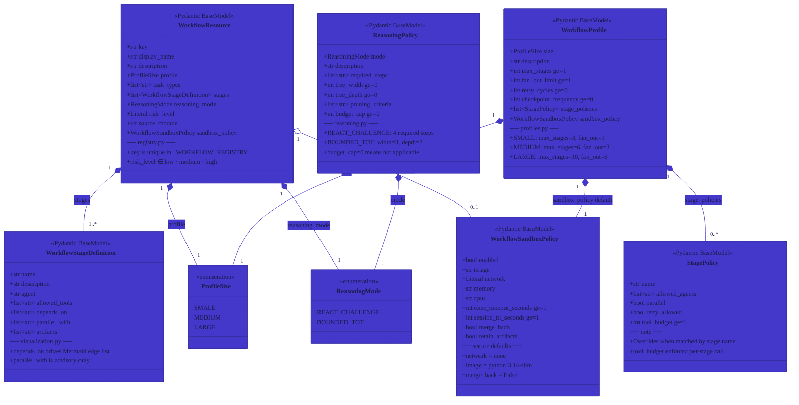

# Workflow Data Models

> **Module:** `src/mem_graph/resources/workflows/models.py`  
> All workflow runtime objects are typed Pydantic v2 models. Pydantic validates every field at
> import time — there is no dynamic schema loading. Profile and reasoning objects are constructed
> once in `profiles.py` / `reasoning.py` and stored in module-level constants.

## Inheritance & Validation Notes

- All models extend `pydantic.BaseModel` — no ORM mapping.
- `ProfileSize` and `ReasoningMode` extend `str, Enum` making them JSON-serialisable as strings.
- `WorkflowSandboxPolicy.network` is `Literal["none", "bridge"]` — only two valid values.
- `WorkflowResource.risk_level` is `Literal["low", "medium", "high"]`.
- `WorkflowResource.sandbox_policy` is optional (`None`); the profile's policy is used as fallback in `selector.py`.

## Model Instantiation Map

| Constant | Module | Type |
|----------|--------|------|
| `SMALL_PROFILE` | `profiles.py` | `WorkflowProfile` |
| `MEDIUM_PROFILE` | `profiles.py` | `WorkflowProfile` |
| `LARGE_PROFILE` | `profiles.py` | `WorkflowProfile` |
| `REACT_CHALLENGE_POLICY` | `reasoning.py` | `ReasoningPolicy` |
| `BOUNDED_TOT_POLICY` | `reasoning.py` | `ReasoningPolicy` |
| `_AUTOPILOT_WORKFLOW` | `registry.py` | `WorkflowResource` |
| `_MANAGED_WORKFLOW` | `registry.py` | `WorkflowResource` |
| `_PACKAGE_AUDIT_WORKFLOW` | `registry.py` | `WorkflowResource` |
