# Iterative Package Audit Workflow

> **Workflow key:** `package_audit` · **Profile:** LARGE · **Risk:** LOW · **Reasoning:** ReAct-Challenge  
> **Task types:** `package_audit`, `batched_audit`  
> **Source module:** `mem_graph.workflows.runtime.package_audit_runtime`

The Package Audit workflow processes large codebases by batching files into 4-5 file chunks,
writing incremental findings as it goes. This bounded approach stays within any LLM context window
limit while producing a consolidated, severity-ranked final report. It is deliberately low-risk:
every stage is read-only except the report update step.

```mermaid
---
config:
  theme: base
  look: classic
  themeVariables:
    primaryColor: "#7c3aed"
    primaryTextColor: "#ffffff"
    primaryBorderColor: "#6d28d9"
    secondaryColor: "#a78bfa"
    tertiaryColor: "#ede9fe"
    lineColor: "#6b7280"
    edgeLabelBackground: "#f5f3ff"
    clusterBkg: "#f5f3ff"
    clusterBorder: "#8b5cf6"
    fontFamily: "ui-monospace, monospace"
    fontSize: "13px"
    nodeBorder: "#6d28d9"
    nodeTextColor: "#3b0764"
---
flowchart TD
    Start(["🚀 START\nAudit scope received"]):::startEnd

    %% ── Phase 1: Discovery & Chunking ────────────────────────────────────
    subgraph SG_DISC ["① Discovery & Chunking  |  read-only phase"]
        direction TB
        discover_files["**discover_files**
        Enumerate every in-scope source file,
        grouped by Python package/module.
        Filter out tests, migrations, and
        generated files per scope config.
        ─────────────────────────
        📦 artifacts: file_inventory
        🛠 tools: file_search, file_grep"]:::stageNode

        chunk_package["**chunk_package**
        Partition each package's file list
        into ordered chunks of 4-5 files.
        Preserves package locality so each
        chunk fits safely inside context window.
        ─────────────────────────
        📦 artifacts: chunks"]:::stageNode

        discover_files --> chunk_package
    end

    %% ── Phase 2: Audit Loop ──────────────────────────────────────────────
    subgraph SG_LOOP ["② Iterative Audit Loop  |  repeats once per chunk  |  agent: auditor"]
        direction TB
        analyze_chunk["**analyze_chunk**
        Auditor reads 4-5 files from current chunk.
        Applies ReAct-Challenge reasoning:
        observe → draft → challenge → decide.
        Emits structured findings per file:
        severity · category · location · rationale.
        ─────────────────────────
        📦 artifacts: chunk_findings
        🛠 tools: file_read, file_grep"]:::stageNode

        update_report["**update_report**
        Append new chunk findings to the
        running report file (incremental write).
        Avoids re-reading previous findings —
        only the delta is written.
        ─────────────────────────
        📦 artifacts: report_section
        🛠 tools: file_read, file_edit, file_write"]:::stageNode

        analyze_chunk --> update_report
    end

    %% ── Phase 3: Finalization ────────────────────────────────────────────
    subgraph SG_FINAL ["③ Finalization  |  deduplication & severity ranking"]
        direction TB
        finalize_report["**finalize_report**
        Load all report sections, deduplicate
        overlapping findings, re-rank by severity.
        Produce the consolidated final report
        ready for human review or downstream use.
        ─────────────────────────
        📦 artifacts: final_report"]:::stageNode
    end

    Finish(["✅ END\nFinal report available"]):::startEnd

    %% ── Edges ────────────────────────────────────────────────────────────
    Start --> discover_files
    chunk_package --> analyze_chunk
    update_report -. "↩ next chunk\n(while chunks remain)" .-> analyze_chunk
    update_report -- "✅ all chunks done" --> finalize_report
    finalize_report --> Finish

    %% ── Styling ──────────────────────────────────────────────────────────
    classDef startEnd  fill:#3b0764,stroke:#7c3aed,color:#ffffff,font-weight:bold,rx:20
    classDef stageNode fill:#f5f3ff,stroke:#8b5cf6,color:#3b0764,text-align:left

    style SG_DISC  fill:#faf5ff,stroke:#8b5cf6,stroke-width:2px,color:#5b21b6,font-weight:bold
    style SG_LOOP  fill:#faf5ff,stroke:#8b5cf6,stroke-width:2px,color:#5b21b6,font-weight:bold
    style SG_FINAL fill:#faf5ff,stroke:#8b5cf6,stroke-width:2px,color:#5b21b6,font-weight:bold
```

## Stage Summary

| # | Stage | Agent | Key Tools | Artifacts | Read-only? |
|---|-------|-------|-----------|-----------|------------|
| 1 | `discover_files` | — | file_search, file_grep | file_inventory | ✅ yes |
| 2 | `chunk_package` | — | — (in-memory) | chunks | ✅ yes |
| 3 | `analyze_chunk` | auditor | file_read, file_grep | chunk_findings | ✅ yes |
| 4 | `update_report` | — | file_read, file_edit, file_write | report_section | ❌ writes report |
| 5 | `finalize_report` | — | file_read, file_edit, file_write | final_report | ❌ writes report |

> **Loop note:** Stages 3–4 repeat for every chunk. The number of iterations equals `ceil(total_files / 4.5)`.

## Profile Constraints (LARGE)

| Constraint | Value |
|------------|-------|
| `max_stages` | 10 |
| `fan_out_limit` | 6 parallel sub-agents |
| `retry_cycles` | 3 |
| `checkpoint_frequency` | every 3 stages |
| Sandbox memory | 2 GB |
| Sandbox CPUs | 4 |
| `exec_timeout_seconds` | 60 |
| `session_ttl_seconds` | 7200 |
