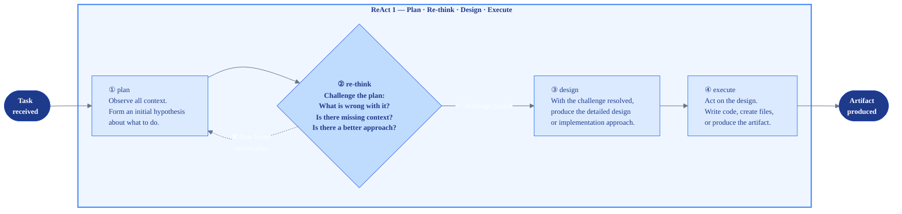
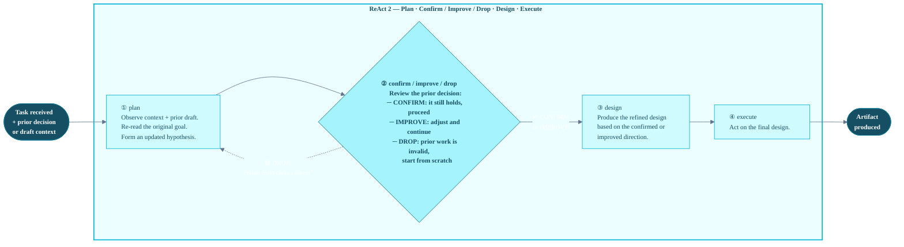
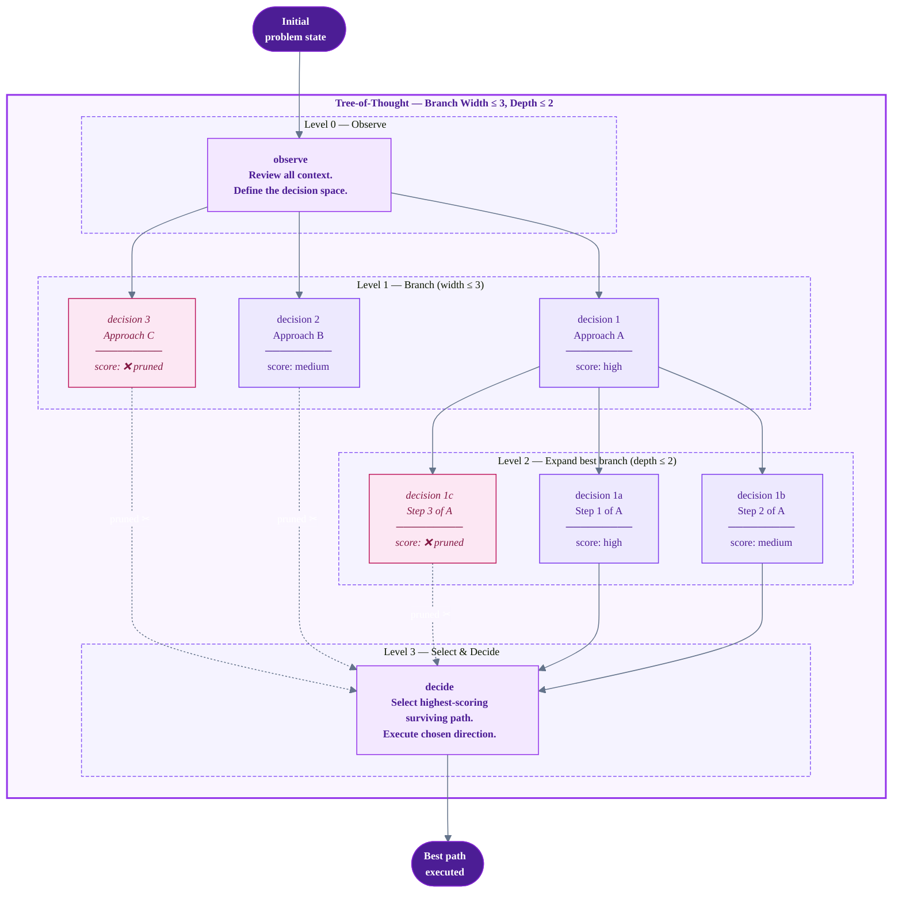
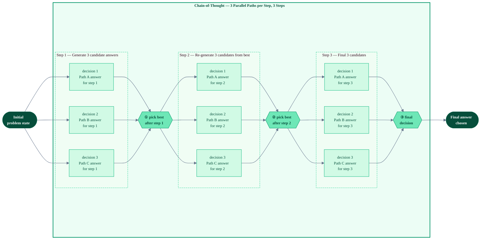
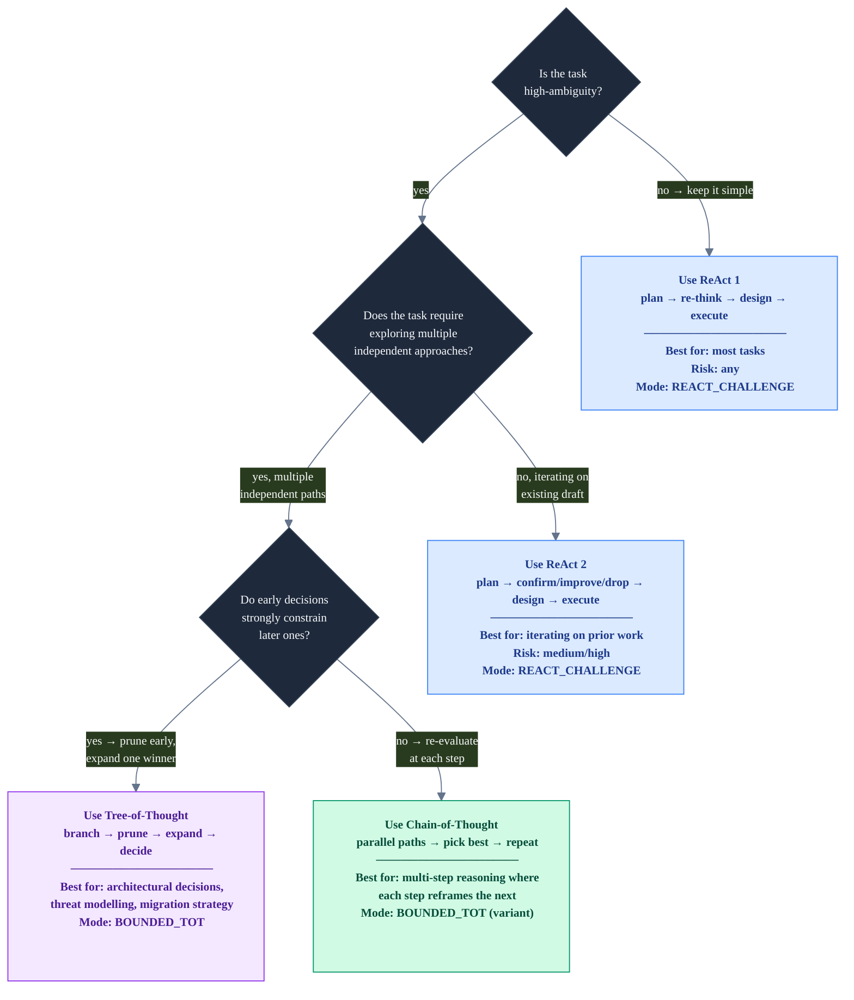

# Reasoning Patterns — Visual Reference

This document provides example workflow diagrams for the four core reasoning patterns used across
the workflow registry. Each pattern is shown as a minimal, self-contained example first, then
mapped to real workflow usage.

> These patterns map to the two `ReasoningMode` values in the registry:  
> - `REACT_CHALLENGE` → ReAct 1 and ReAct 2  
> - `BOUNDED_TOT` → Tree-of-Thought and Chain-of-Thought

---

## ReAct 1 — Plan · Re-think · Design · Execute

The **default reasoning pattern**. Every major decision goes through a self-challenge step
("re-think") before design begins. If the re-think reveals a flaw, the plan is restarted.
This prevents acting on a bad first instinct.

**Used by:** most MEDIUM and LARGE workflows (`feature_implementation`, `managed_workflow_graph`,
`autopilot_graph` guard stage, `adr_authoring`, `refactor`, etc.)

---

## ReAct 2 — Plan · Confirm/Improve/Drop · Design · Execute

An **extended variant** with an explicit decision gate *before* design: the previous decision or
draft is surfaced and the agent must actively choose to confirm it, improve it, or drop it
(start over). Forces conscious acknowledgment of prior work rather than silent continuation.

**Used by:** `implementation_planning` (reviewing the feature design before committing to a code
plan), `adr_authoring` (explicitly confirms or revises the previous decision), `requirements_elicitation`
(challenge-scope gate).

---

## Tree-of-Thought (ToT) — Branch · Prune · Select · Expand · Decide

**Bounded Tree-of-Thought** explores multiple candidate approaches simultaneously, scores them
against pruning criteria, eliminates the losers, and only *then* expands the winning branch into
a full solution. Width and depth are hard-capped (`width=3, depth=2, budget_cap=500`).

**Pruning criteria** (from `BOUNDED_TOT_POLICY`):
1. Violates an active architectural decision
2. Requires more context than is available
3. Exceeds the tool budget for the current stage
4. Creates a circular dependency

**Used by:** `architecture_design`, `research`, `requirements_elicitation`, `schema_design`,
`disaster_recovery`, `security_hardening`, `codebase_migration`, `code_skeptic`

---

## Chain-of-Thought (CoT) — Parallel Paths · Step-wise Best-Pick · Converge

**Chain-of-Thought** runs multiple reasoning paths in parallel at each step, picks the best
candidate after each step, then carries only that candidate forward into the next step.
This prevents local optima by exploring width at every level, not just the first.

**How CoT differs from ToT:**

| | Tree-of-Thought | Chain-of-Thought |
|-|----------------|-----------------|
| Structure | Tree: branches prune across levels | Chain: parallel choices at each step, best carries forward |
| Width | Fixed max at root, expands downward | Regenerated fresh at every step |
| Pruning | Happens at each level | Implicit: only the best candidate survives each round |
| Best for | Architecture decisions, threat modelling | Multi-step reasoning where each step reframes the next |
| Registry mapping | `BOUNDED_TOT_POLICY` | Can be modelled as a ToT variant with depth-per-step reset |

> **Current registry note:** `BOUNDED_TOT_POLICY` captures both ToT and CoT intent.
> A future `CHAIN_OF_THOUGHT` `ReasoningMode` variant could differentiate them explicitly.

---

## Pattern Selection Guide

