# Recommended Workflows — Full App Development Lifecycle

This document maps recommended `WorkflowResource` additions against every phase of the software
development lifecycle — from the first idea on paper through deployment and long-term maintenance.
Each entry includes a proposed registry key, profile size, reasoning mode, and the specific agent
roster that would implement it.

> See [`reasoning_patterns.md`](./reasoning_patterns.md) for visual examples of ReAct, ToT, and CoT patterns
> used across these workflows.

---

## Coverage Map

```mermaid
---
config:
  theme: base
  look: classic
  themeVariables:
    primaryColor: "#0f172a"
    primaryTextColor: "#f8fafc"
    primaryBorderColor: "#334155"
    secondaryColor: "#1e40af"
    tertiaryColor: "#dbeafe"
    lineColor: "#475569"
    fontFamily: "ui-monospace, monospace"
    fontSize: "11px"
---
flowchart TD
    classDef existing  fill:#1e3a5f,stroke:#3b82f6,color:#fff,font-weight:bold
    classDef new       fill:#14532d,stroke:#22c55e,color:#fff,font-weight:bold
    classDef typed     fill:#3b1f5e,stroke:#a855f7,color:#fff,font-weight:bold

    subgraph P1 ["💡 Phase 1 — Ideation & Discovery"]
        direction LR
        W01["idea_capture 🆕"]:::new
        W02["research 🆕"]:::new
        W03["requirements_elicitation 🆕"]:::new
    end

    subgraph P2 ["🏗 Phase 2 — Architecture & Design"]
        direction LR
        W04["architecture_design 🆕"]:::new
        W05["feature_design 🆕"]:::new
        W06["adr_authoring 🆕"]:::new
        W07["schema_design 🆕"]:::new
        W08["api_contract_design 🆕"]:::new
        W09["design_docs 🆕"]:::new
        W10["runbook_authoring 🆕"]:::new
        W11["disaster_recovery 🆕"]:::new
        W12["command_design 🆕"]:::new
        W13["error_logging_design 🆕"]:::new
    end

    subgraph P3 ["🧪 Phase 3 — Development Setup"]
        direction LR
        W14["project_scaffold 🆕"]:::new
        W15["dependency_audit 🆕"]:::new
        W16["ci_setup 🆕"]:::new
    end

    subgraph P4 ["⚙️ Phase 4 — Feature Development"]
        direction LR
        W17["implementation_planning 🆕"]:::new
        W18["feature_implementation 🆕"]:::new
        W19["test_coverage ★"]:::typed
        W20["code_review ★"]:::typed
    end

    subgraph P5 ["🛡 Phase 5 — Quality & Hardening"]
        direction LR
        W21["security_hardening 🆕"]:::new
        W22["performance_profiling 🆕"]:::new
        W_PA["package_audit ✅"]:::existing
        W_AP["autopilot_graph ✅"]:::existing
    end

    subgraph P6 ["📝 Phase 6 — Documentation"]
        direction LR
        W23["docs_generation 🆕"]:::new
        W24["changelog_authoring 🆕"]:::new
        W25["onboarding_docs 🆕"]:::new
    end

    subgraph P7 ["🚀 Phase 7 — Release & Deployment"]
        direction LR
        W26["release_preparation 🆕"]:::new
        W27["deployment_validation 🆕"]:::new
    end

    subgraph P8 ["🔄 Phase 8 — Maintenance & Evolution"]
        direction LR
        W28["refactor 🆕"]:::new
        W29["codebase_migration 🆕"]:::new
        W30["code_skeptic 🆕"]:::new
        W31["utility_extraction 🆕"]:::new
        W_MF["managed_workflow_graph ✅"]:::existing
    end

    P1 --> P2 --> P3 --> P4 --> P5 --> P6 --> P7 --> P8
```

**Legend:**
- ✅ `EXISTS` — already registered in `registry.py`
- ★ `TYPED` — task type mapped in `task_types.py`, no dedicated `WorkflowResource` yet
- 🆕 `NEW` — recommended addition

---

## Phase 1 — Ideation & Discovery

### `idea_capture`
**Profile:** SMALL · **Risk:** low · **Reasoning:** ReAct-Challenge

Capture raw ideas, notes, sketches, or voice-to-text transcripts and convert them into a structured
problem statement stored in graph memory. No code is created. Output is a `Conversation`/`Decision`
node in the graph and a seed requirements document.

| Field | Value |
|-------|-------|
| `task_types` | `idea_capture`, `brainstorm` |
| Stages | `ingest_notes` → `structure_problem` → `memory_store` |
| Agents | scribe, chat |
| Tools | file_write, MCP memory tools |

---

### `research`
**Profile:** MEDIUM · **Risk:** low · **Reasoning:** Bounded-ToT

Research prior art, feasibility, competing solutions, existing libraries, and technical alternatives
*before* requirements are formalised (or after them, to validate scope). Produces a structured
research report with citations, tradeoff matrix, and a recommended direction. Uses Bounded-ToT to
evaluate multiple research paths in parallel before converging.

> This slot sits between `idea_capture` and `requirements_elicitation`. Research informs what
> requirements are actually possible.

| Field | Value |
|-------|-------|
| `task_types` | `research`, `feasibility_study`, `tech_evaluation` |
| Stages | `define_questions` → `search_sources` → `evaluate_options` → `synthesise_findings` → `write_report` → `memory_store` |
| Agents | auditor, scribe |
| Tools | file_read, file_write, MCP memory tools |

---

### `requirements_elicitation`
**Profile:** MEDIUM · **Risk:** low · **Reasoning:** Bounded-ToT

Parse a spec document or structured interview notes and draft formal user stories, acceptance
criteria, and a bounded scope statement. Bounded-ToT branches over alternative feature
interpretations before committing to a final spec.

| Field | Value |
|-------|-------|
| `task_types` | `requirements_elicitation`, `user_story` |
| Stages | `read_inputs` → `draft_stories` → `challenge_scope` → `finalize_spec` → `memory_store` |
| Agents | scribe, chat |
| Tools | file_read, file_write, MCP memory tools |

---

## Phase 2 — Architecture & Design

### `architecture_design`
**Profile:** LARGE · **Risk:** high · **Reasoning:** Bounded-ToT

Generate candidate high-level architectures from requirements. Evaluate each candidate against
constraints (scale, team size, existing stack, cost). Produces a set of C4 Mermaid diagrams and
an Architecture Decision Record (ADR). Bounded-ToT is mandatory here — never commit to a single
architecture without exploring at least 2–3 alternatives.

| Field | Value |
|-------|-------|
| `task_types` | `architecture_design`, `system_design` |
| Stages | `read_requirements` → `generate_candidates` → `evaluate_candidates` → `select_architecture` → `write_adr` → `write_diagrams` → `memory_store` |
| Agents | router, scribe, auditor |
| Tools | file_read, file_write, MCP memory tools |

---

### `feature_design`
**Profile:** MEDIUM · **Risk:** medium · **Reasoning:** ReAct-Challenge

Produce the detailed design for a **single feature**: component decomposition, internal data flow,
interface contracts, edge cases, and error paths. Distinct from `architecture_design` (which is
system-wide) and `implementation_planning` (which is the coding task breakdown).

> Output: a feature design document + component diagram that becomes the input to
> `implementation_planning` and `feature_implementation`.

| Field | Value |
|-------|-------|
| `task_types` | `feature_design`, `component_design` |
| Stages | `read_architecture` → `read_requirements` → `draft_design` → `challenge_design` → `write_design_doc` → `write_diagram` → `memory_store` |
| Agents | scribe, auditor |
| Tools | file_read, file_write, MCP memory tools |

---

### `adr_authoring`
**Profile:** MEDIUM · **Risk:** medium · **Reasoning:** ReAct-Challenge

Author or update a single Architecture Decision Record for a concrete technical choice (e.g.
"why we chose Ladybug over SQLite", "why we use FastMCP over raw Starlette"). Reads existing ADRs
for consistency, challenges the decision against known constraints, then writes and graph-links the ADR.

| Field | Value |
|-------|-------|
| `task_types` | `adr_authoring`, `decision_record` |
| Stages | `read_existing_adrs` → `draft_adr` → `challenge` → `finalize_adr` → `memory_store` |
| Agents | scribe |
| Tools | file_read, file_write, MCP memory tools |

---

### `schema_design`
**Profile:** MEDIUM · **Risk:** medium · **Reasoning:** Bounded-ToT

Design or evolve any data schema: **SQL, Cypher, Protobuf, JSON Schema, Avro, Pydantic models,
GraphQL types** — any structured data contract. Proposes candidate schemas, evaluates migration
complexity, then produces the updated schema file and a migration plan document.

| Field | Value |
|-------|-------|
| `task_types` | `schema_design`, `database_design`, `data_modeling` |
| Stages | `read_existing_schema` → `read_models` → `propose_candidates` → `evaluate_compatibility` → `write_schema` → `write_migration_plan` |
| Agents | auditor, scribe |
| Tools | file_read, file_edit, file_write |

---

### `api_contract_design`
**Profile:** MEDIUM · **Risk:** medium · **Reasoning:** ReAct-Challenge

Draft or update an **OpenAPI / AsyncAPI / JSON-RPC / MCP tool contract** from requirements and
existing implementation. Validates the contract against code stubs and produces a versioned spec file.

| Field | Value |
|-------|-------|
| `task_types` | `api_contract_design`, `openapi`, `mcp_tool_spec` |
| Stages | `read_requirements` → `read_existing_api` → `draft_contract` → `validate_contract` → `write_spec` |
| Agents | scribe, auditor |
| Tools | file_read, file_write, file_search |

---

### `design_docs`
**Profile:** MEDIUM · **Risk:** low · **Reasoning:** ReAct-Challenge

Write a free-form **technical design document** for a cross-cutting concern, subsystem, or
implementation approach that does not fit neatly into an ADR or API spec. Examples: "how the
embedding pipeline works", "retry strategy design", "task queue design". Produces a Markdown doc
stored in `docs/design/`.

| Field | Value |
|-------|-------|
| `task_types` | `design_docs`, `technical_design` |
| Stages | `read_context` → `draft_design` → `review_design` → `write_doc` → `memory_store` |
| Agents | scribe |
| Tools | file_read, file_write, MCP memory tools |

---

### `runbook_authoring`
**Profile:** SMALL · **Risk:** low · **Reasoning:** ReAct-Challenge

Author **operational runbooks**: step-by-step, human-executable procedures for operating,
diagnosing, and maintaining the system in production. Examples: "how to restart the MCP server",
"how to rotate API keys", "how to recover from a DB lock". Stored in `docs/runbooks/`.

| Field | Value |
|-------|-------|
| `task_types` | `runbook_authoring`, `ops_procedure` |
| Stages | `read_system_context` → `draft_steps` → `validate_steps` → `write_runbook` |
| Agents | scribe |
| Tools | file_read, file_write |

---

### `disaster_recovery`
**Profile:** MEDIUM · **Risk:** high · **Reasoning:** Bounded-ToT

Produce a **Disaster Recovery (DR) plan**: identify failure modes, define RTO/RPO targets per
component, specify recovery procedures, and map communication escalation paths. Bounded-ToT is
used to evaluate multiple DR strategies (cold standby, warm failover, active-active) before
selecting one.

| Field | Value |
|-------|-------|
| `task_types` | `disaster_recovery`, `dr_planning` |
| Stages | `read_architecture` → `identify_failure_modes` → `evaluate_strategies` → `define_procedures` → `write_dr_plan` → `memory_store` |
| Agents | auditor, scribe |
| Tools | file_read, file_write, MCP memory tools |

---

### `command_design`
**Profile:** SMALL · **Risk:** low · **Reasoning:** ReAct-Challenge

Design the **CLI / command interface** for a tool or agent: command names, flags, argument
names, output formats, exit codes. Similar discipline to `api_contract_design` but for command-line
surfaces. Produces a command spec document and stub implementation.

| Field | Value |
|-------|-------|
| `task_types` | `command_design`, `cli_design` |
| Stages | `read_requirements` → `draft_command_spec` → `validate_spec` → `write_spec` → `write_stubs` |
| Agents | scribe, fixer |
| Tools | file_read, file_write |

---

### `error_logging_design`
**Profile:** SMALL · **Risk:** low · **Reasoning:** ReAct-Challenge

Define the **error taxonomy, log-level strategy, structured log schema, and alerting hooks** for
the system. Produces: an error code/category catalogue, a log schema (JSON fields), log-level
usage guide, and a structured logging implementation plan.

| Field | Value |
|-------|-------|
| `task_types` | `error_logging_design`, `observability_design` |
| Stages | `read_existing_logs` → `draft_taxonomy` → `draft_schema` → `write_design_doc` |
| Agents | scribe, auditor |
| Tools | file_read, file_write, file_grep |

---

## Phase 3 — Development Setup

### `project_scaffold`
**Profile:** MEDIUM · **Risk:** low · **Reasoning:** ReAct-Challenge

Bootstrap a new project from an architecture spec: create the directory layout, `pyproject.toml`,
CI pipeline config, `.env.example`, initial `__init__.py` module stubs, and first test file.
Validates the scaffold structure against project conventions before writing.

| Field | Value |
|-------|-------|
| `task_types` | `project_scaffold`, `bootstrap` |
| Stages | `read_spec` → `generate_structure` → `validate_structure` → `write_files` → `write_ci` |
| Agents | fixer, scribe |
| Tools | file_read, file_write, file_search |

---

### `dependency_audit`
**Profile:** MEDIUM · **Risk:** medium · **Reasoning:** ReAct-Challenge

Audits your project's **external package graph** — `pyproject.toml` / `requirements.txt` / lockfile —
for: version conflicts, known CVEs in declared dependencies, deprecated packages, and unused
transitive dependencies. Produces a prioritised update plan.

> **Not to be confused with `package_audit`**, which audits your own *source code* package
> structure and quality. This workflow looks outward at third-party libraries.

| Field | Value |
|-------|-------|
| `task_types` | `dependency_audit`, `supply_chain` |
| Stages | `read_lockfile` → `check_vulnerabilities` → `check_compatibility` → `check_unused` → `write_report` |
| Agents | auditor |
| Tools | file_read, file_write |

---

### `ci_setup`
**Profile:** MEDIUM · **Risk:** medium · **Reasoning:** ReAct-Challenge

**CI = Continuous Integration.** GitHub Actions, GitLab CI, Bitbucket Pipelines, etc. are
automated pipelines that run on every commit or pull request: run tests, lint, type-check, build
artifacts, maybe deploy to staging. `ci_setup` authors or updates those pipeline `.yml` definition
files from project conventions and the existing Makefile/scripts.

| Field | Value |
|-------|-------|
| `task_types` | `ci_setup`, `pipeline_authoring` |
| Stages | `read_project` → `read_existing_ci` → `draft_pipeline` → `validate_pipeline` → `write_pipeline` |
| Agents | scribe, auditor |
| Tools | file_read, file_write |

---

## Phase 4 — Feature Development

### `implementation_planning`
**Profile:** MEDIUM · **Risk:** low · **Reasoning:** ReAct-Challenge

Produce a structured **pre-code implementation plan** from a feature design doc: which files to
create or edit, in what order, what each function/class does, estimated complexity. The output is
a `task.md`-style checklist that `feature_implementation` executes against.

> Distinct from `feature_design` (diagrams + interfaces) and `architecture_design` (system scope).
> This is: "here's the exact code we're going to write and in what order."

| Field | Value |
|-------|-------|
| `task_types` | `implementation_planning`, `task_breakdown` |
| Stages | `read_feature_design` → `read_codebase_context` → `draft_plan` → `review_plan` → `write_plan_doc` |
| Agents | router, scribe |
| Tools | file_read, file_write, MCP memory tools |

---

### `feature_implementation`
**Profile:** LARGE · **Risk:** medium · **Reasoning:** ReAct-Challenge

Full-lifecycle feature implementation: read the implementation plan → write failing tests (sentry-first)
→ implement to pass them → audit output → validate → document. The sentry-first discipline from
`autopilot_graph` applies here too, but triggered by a feature ticket rather than a violation report.

| Field | Value |
|-------|-------|
| `task_types` | `feature`, `feature_implementation` |
| Stages | `read_plan` → `sentry` → `implementation` → `audit` → `debug_validation` → `documentation` → `memory_store` |
| Agents | sentry, fixer, auditor, scribe |
| Tools | file_read, file_edit, file_write, file_search, file_grep |

> `feature` is already mapped to MEDIUM in `task_types.py`. This gives it a dedicated
> `WorkflowResource` with the sentry-first stage order.

---

## Phase 5 — Quality & Hardening

### `security_hardening`
**Profile:** LARGE · **Risk:** high · **Reasoning:** Bounded-ToT

Systematic security review and hardening: injection points, secret scanning, authentication flows,
input validation gaps. Produces findings, proposes and applies fixes with full audit trail.
More thorough than `autopilot_graph` — uses Bounded-ToT for threat modelling to avoid missing
non-obvious attack surfaces.

> CWE/policy enforcement is handled separately by the policy enforcer system — keep this workflow
> focused on structural hardening, not policy compliance.

| Field | Value |
|-------|-------|
| `task_types` | `security_hardening`, `security_audit` |
| Stages | `threat_model` → `scan_inputs` → `scan_auth` → `propose_fixes` → `implement_fixes` → `validate` → `write_report` |
| Agents | auditor, fixer, scribe |
| Tools | file_read, file_edit, file_write, file_grep, file_search |

---

### `performance_profiling`
**Profile:** LARGE · **Risk:** low · **Reasoning:** Bounded-ToT

Read hot-path code, analyse algorithmic complexity (time and space), identify N+1 patterns,
unnecessary allocations, and synchronous bottlenecks. Proposes optimisations ranked by expected
gain vs implementation scope. Produces a profiling report and an optional patch set.

| Field | Value |
|-------|-------|
| `task_types` | `performance_profiling`, `performance_analysis` |
| Stages | `identify_hot_paths` → `read_hot_paths` → `analyse_complexity` → `generate_candidates` → `rank_candidates` → `implement` → `write_report` |
| Agents | auditor, fixer, scribe |
| Tools | file_read, file_edit, file_write, file_grep |

---

### `package_audit` ✅ (already exists)
Audits **your own source code packages**: code quality, structure, smell detection, dead exports,
modules doing too much, missing `__all__`, incorrect visibility. Operates on your *own folders/modules*,
not external libraries.

> See [`package_audit_workflow.md`](./package_audit_workflow.md) for the full diagram.

---

## Phase 6 — Documentation

### `docs_generation`
**Profile:** MEDIUM · **Risk:** low · **Reasoning:** ReAct-Challenge

Generate or refresh project documentation from source code: docstrings → Markdown API reference,
module overviews, and architecture diagrams. Uses the code symbol graph stored in memory for
navigation. Output stored in `docs/`.

| Field | Value |
|-------|-------|
| `task_types` | `docs_generation`, `api_reference` |
| Stages | `read_source` → `extract_symbols` → `draft_docs` → `write_docs` → `memory_store` |
| Agents | scribe |
| Tools | file_read, file_write, file_search |

---

### `changelog_authoring`
**Profile:** SMALL · **Risk:** low · **Reasoning:** ReAct-Challenge

Read commit log summaries from memory graph, group by semantic type (`feat`/`fix`/`chore`/`refactor`),
and produce a formatted `CHANGELOG.md` entry for the current version.

| Field | Value |
|-------|-------|
| `task_types` | `changelog_authoring`, `release_notes` |
| Stages | `read_commits` → `group_changes` → `write_changelog` |
| Agents | scribe |
| Tools | file_read, file_write, MCP memory tools |

---

### `onboarding_docs`
**Profile:** MEDIUM · **Risk:** low · **Reasoning:** ReAct-Challenge

Generate developer onboarding documentation from project structure, architecture ADRs, setup
scripts, and workflow definitions. Produces `CONTRIBUTING.md` and a `docs/onboarding/` guide
covering: environment setup, running tests, understanding the codebase, and first-contribution steps.

| Field | Value |
|-------|-------|
| `task_types` | `onboarding_docs`, `developer_guide` |
| Stages | `read_architecture` → `read_workflows` → `read_setup` → `draft_guide` → `write_guide` |
| Agents | scribe |
| Tools | file_read, file_write, file_search |

---

## Phase 7 — Release & Deployment

### `release_preparation`
**Profile:** MEDIUM · **Risk:** high · **Reasoning:** ReAct-Challenge

Checklist executor for everything before tagging a release: version bump in `pyproject.toml`,
changelog update, dependency lock, CI gate confirmation, and release notes. Refuses to complete
if any gate fails.

| Field | Value |
|-------|-------|
| `task_types` | `release_preparation`, `release` |
| Stages | `read_version` → `bump_version` → `update_changelog` → `lock_dependencies` → `validate_ci` → `write_release_notes` |
| Agents | scribe, auditor |
| Tools | file_read, file_edit, file_write |

---

### `deployment_validation`
**Profile:** MEDIUM · **Risk:** high · **Reasoning:** ReAct-Challenge

Post-deploy sanity check: verify environment variables are complete, run health-check scripts,
validate service connectivity, and produce a deployment status report. Routes to rollback
guidance if critical checks fail.

| Field | Value |
|-------|-------|
| `task_types` | `deployment_validation`, `smoke_test` |
| Stages | `read_manifests` → `check_env_vars` → `run_healthchecks` → `evaluate` → `write_report` |
| Agents | auditor |
| Tools | file_read, file_write, file_search |

---

## Phase 8 — Maintenance & Evolution

### `refactor`
**Profile:** LARGE · **Risk:** medium · **Reasoning:** ReAct-Challenge

Structured refactoring pass with full audit trail: read scope, map dependencies, plan incremental
change batches, refactor one batch, validate (tests + types + lint), repeat. Safe, incremental —
never a big-bang rewrite. Each batch is independently validatable.

> `refactoring` is already type-mapped in `task_types.py` but has no dedicated `WorkflowResource`.
> This gives it a structured, validated stage sequence.

| Field | Value |
|-------|-------|
| `task_types` | `refactoring`, `refactor` |
| Stages | `read_scope` → `map_dependencies` → `plan_batches` → `refactor_batch` → `validate_batch` → `repeat_or_finalize` → `write_report` |
| Agents | mapper, fixer, auditor, scribe |
| Tools | file_read, file_edit, file_write, file_search, file_grep |

---

### `codebase_migration`
**Profile:** LARGE · **Risk:** high · **Reasoning:** Bounded-ToT

Large-scale **code-level transformation within the same codebase**: Pydantic v1→v2, Python 3.10→3.12,
swapping an ORM, migrating from one framework to another. *Not* a server/cloud migration.
Bounded-ToT evaluates migration strategies before committing. Incremental: one module group at
a time, each validated before proceeding.

| Field | Value |
|-------|-------|
| `task_types` | `migration`, `codebase_migration` |
| Stages | `read_scope` → `generate_strategies` → `select_strategy` → `plan_modules` → `migrate_module_batch` → `validate_batch` → `finalize` → `write_report` |
| Agents | mapper, fixer, auditor, scribe |
| Tools | file_read, file_edit, file_write, file_search, file_grep |

---

### `code_skeptic`
**Profile:** LARGE · **Risk:** low · **Reasoning:** Bounded-ToT

**Adversarial doubt-first audit.** Plays devil's advocate against your own codebase — looking for
brittle assumptions, hidden failure modes, questionable design choices, overengineered abstractions,
and silent error paths. Distinct from `code_review` (correctness) and `security_hardening`
(security-only). This workflow asks: *"what could go catastrophically wrong here, and why did we
assume it wouldn't?"*

| Field | Value |
|-------|-------|
| `task_types` | `code_skeptic`, `adversarial_review` |
| Stages | `read_scope` → `generate_doubt_vectors` → `probe_assumptions` → `evaluate_severity` → `write_findings` → `optional_fix` |
| Agents | auditor |
| Tools | file_read, file_grep, file_search, file_write |

---

### `utility_extraction`
**Profile:** MEDIUM · **Risk:** medium · **Reasoning:** ReAct-Challenge

Scan the codebase for **repeated small functions and patterns** (copy-pasted logic, inline
one-liners duplicated across modules) and consolidate them into shared utility modules
(`utils/`, `shared/`, or a dedicated package). Each extraction is validated by confirming all
call sites still pass tests.

| Field | Value |
|-------|-------|
| `task_types` | `utility_extraction`, `deduplication` |
| Stages | `scan_duplicates` → `group_by_pattern` → `plan_extractions` → `extract_batch` → `update_call_sites` → `validate` → `write_report` |
| Agents | mapper, fixer, auditor |
| Tools | file_read, file_edit, file_write, file_grep, file_search |

---

### `research` *(cross-cutting)*
**Profile:** MEDIUM · **Risk:** low · **Reasoning:** Bounded-ToT

Research is a **cross-phase workflow** — it can appear in Phase 1 (pre-requirements feasibility),
Phase 2 (tech choice evaluation), or Phase 8 (finding solutions to maintenance problems). Same
`WorkflowResource` key works in all contexts.

> Defined fully under Phase 1. Register once, use anywhere.

---

## Summary Table

| # | Key | Profile | Risk | Reasoning | Phase |
|---|-----|---------|------|-----------|-------|
| 1 | `idea_capture` | SMALL | low | ReAct | Ideation |
| 2 | `research` | MEDIUM | low | Bounded-ToT | Ideation (cross-cutting) |
| 3 | `requirements_elicitation` | MEDIUM | low | Bounded-ToT | Ideation |
| 4 | `architecture_design` | LARGE | high | Bounded-ToT | Architecture |
| 5 | `feature_design` | MEDIUM | medium | ReAct | Architecture |
| 6 | `adr_authoring` | MEDIUM | medium | ReAct | Architecture |
| 7 | `schema_design` | MEDIUM | medium | Bounded-ToT | Architecture |
| 8 | `api_contract_design` | MEDIUM | medium | ReAct | Architecture |
| 9 | `design_docs` | MEDIUM | low | ReAct | Architecture |
| 10 | `runbook_authoring` | SMALL | low | ReAct | Architecture |
| 11 | `disaster_recovery` | MEDIUM | high | Bounded-ToT | Architecture |
| 12 | `command_design` | SMALL | low | ReAct | Architecture |
| 13 | `error_logging_design` | SMALL | low | ReAct | Architecture |
| 14 | `project_scaffold` | MEDIUM | low | ReAct | Setup |
| 15 | `dependency_audit` | MEDIUM | medium | ReAct | Setup |
| 16 | `ci_setup` | MEDIUM | medium | ReAct | Setup |
| 17 | `implementation_planning` | MEDIUM | low | ReAct | Development |
| 18 | `feature_implementation` | LARGE | medium | ReAct | Development |
| 19 | `security_hardening` | LARGE | high | Bounded-ToT | Hardening |
| 20 | `performance_profiling` | LARGE | low | Bounded-ToT | Hardening |
| 21 | `docs_generation` | MEDIUM | low | ReAct | Documentation |
| 22 | `changelog_authoring` | SMALL | low | ReAct | Documentation |
| 23 | `onboarding_docs` | MEDIUM | low | ReAct | Documentation |
| 24 | `release_preparation` | MEDIUM | high | ReAct | Release |
| 25 | `deployment_validation` | MEDIUM | high | ReAct | Release |
| 26 | `refactor` | LARGE | medium | ReAct | Maintenance |
| 27 | `codebase_migration` | LARGE | high | Bounded-ToT | Maintenance |
| 28 | `code_skeptic` | LARGE | low | Bounded-ToT | Maintenance |
| 29 | `utility_extraction` | MEDIUM | medium | ReAct | Maintenance |

> **Already registered:** `autopilot_graph`, `managed_workflow_graph`, `package_audit`  
> **Already type-mapped, no dedicated resource:** `bug_fix`, `hotfix`, `refactoring`, `documentation`, `test_coverage`, `code_review`, `security_patch`, `dependency_update`
