# Workflow Selection Logic

> **Module:** `src/mem_graph/resources/workflows/selector.py`  
> The selector is the single deterministic entry point for all workflow dispatch.
> Call `select_all(...)` to get a `WorkflowSelection` containing a `WorkflowResource`,
> `WorkflowProfile`, `ReasoningPolicy`, and effective `WorkflowSandboxPolicy` in one shot.

```mermaid
---
config:
  theme: base
  look: classic
  themeVariables:
    primaryColor: "#be185d"
    primaryTextColor: "#ffffff"
    primaryBorderColor: "#9d174d"
    secondaryColor: "#f472b6"
    tertiaryColor: "#fce7f3"
    lineColor: "#6b7280"
    edgeLabelBackground: "#fdf2f8"
    clusterBkg: "#fdf2f8"
    clusterBorder: "#ec4899"
    fontFamily: "ui-monospace, monospace"
    fontSize: "13px"
    nodeBorder: "#9d174d"
    nodeTextColor: "#500724"
---
flowchart TD
    Entry(["🔍 select_all\ntask_type · file_count · risk_level\npreferred_key · size_override\nhigh_ambiguity · tot_allowed"]):::startEnd

    %% ── Step 1: Workflow selection ────────────────────────────────────────
    subgraph SG_WF ["① Workflow Selection  |  select_workflow()"]
        direction TB
        A_Workflow["**select_workflow(task_type, preferred_key)**
        Priority 1 → preferred_key lookup in registry
        Priority 2 → first workflow whose task_types contains task_type
        Priority 3 → managed_workflow_graph fallback
        Priority 4 → all_workflows first entry"]:::stageNode

        Q_Preferred{"Has\npreferred_key?"}:::decisionNode
        Preferred_Found{"Found in\nregistry?"}:::decisionNode
        Q_TaskMatch{"task_type in\nwf.task_types?"}:::decisionNode

        A_Workflow --> Q_Preferred
        Q_Preferred -- "yes" --> Preferred_Found
        Preferred_Found -- "yes → return override" --> WF_Result["WorkflowResource selected"]:::resultNode
        Preferred_Found -- "no → fall through" --> Q_TaskMatch
        Q_Preferred -- "no" --> Q_TaskMatch
        Q_TaskMatch -- "yes → return match" --> WF_Result
        Q_TaskMatch -- "no → fallback" --> WF_Fallback["managed_workflow_graph\n(or first registered)"]:::fallbackNode
        WF_Fallback --> WF_Result
    end

    %% ── Step 2: Profile selection ─────────────────────────────────────────
    subgraph SG_PROF ["② Profile Size Selection  |  select_profile()"]
        direction TB
        B_Profile["**select_profile(task_type, file_count, risk_level, size_override)**
        Check explicit override first, then apply scaling rules."]:::stageNode

        Q_SizeOverride{"size_override\nprovided?"}:::decisionNode
        Override_Profile["Return explicit\nProfileSize"]:::resultNode

        Base_Profile["Get base size\nfrom TASK_TYPE_PROFILE_MAP\n(default: MEDIUM if unknown)"]:::stageNode

        Q_FC20{"file_count\n>= 20?"}:::decisionNode
        Q_FC5{"file_count >= 5\nAND base is SMALL?"}:::decisionNode
        Q_Risk{"risk='high'\nAND base is SMALL?"}:::decisionNode

        P_Large["Force → LARGE"]:::resultNode
        P_Medium["Upgrade → MEDIUM\n(file count rule)"]:::resultNode
        P_MedRisk["Upgrade → MEDIUM\n(risk level rule)"]:::resultNode
        P_Keep["Keep base size\nas-is"]:::resultNode

        B_Profile --> Q_SizeOverride
        Q_SizeOverride -- "yes" --> Override_Profile
        Q_SizeOverride -- "no" --> Base_Profile
        Base_Profile --> Q_FC20
        Q_FC20 -- "yes" --> P_Large
        Q_FC20 -- "no" --> Q_FC5
        Q_FC5 -- "yes" --> P_Medium
        Q_FC5 -- "no" --> Q_Risk
        Q_Risk -- "yes" --> P_MedRisk
        Q_Risk -- "no" --> P_Keep
    end

    %% ── Step 3: Reasoning policy ──────────────────────────────────────────
    subgraph SG_REASON ["③ Reasoning Policy Selection  |  select_reasoning_policy()"]
        direction TB
        C_Reasoning["**select_reasoning_policy(high_ambiguity, tot_allowed)**
        ReAct-Challenge is always the safe default.
        Bounded ToT is ONLY selected when BOTH flags are True."]:::stageNode

        Q_ToT{"high_ambiguity AND\ntot_allowed?"}:::decisionNode
        R_REACT["REACT_CHALLENGE_POLICY
        ─── 4 required steps ───
        1. observe  2. draft
        3. challenge  4. decide"]:::resultNode
        R_TOT["BOUNDED_TOT_POLICY
        ─── 6 required steps ───
        width=3 · depth=2
        budget_cap=500"]:::resultNode

        C_Reasoning --> Q_ToT
        Q_ToT -- "no (default)" --> R_REACT
        Q_ToT -- "yes" --> R_TOT
    end

    %% ── Step 4: Sandbox resolution ────────────────────────────────────────
    subgraph SG_SBX ["④ Sandbox Policy Resolution  |  inline in select_all()"]
        direction TB
        D_Sandbox["**sandbox_policy = workflow.sandbox_policy or profile.sandbox_policy**
        Workflow-level policy takes precedence.
        Falls back to the profile default if workflow has none (None)."]:::stageNode
    end

    %% ── Final result ──────────────────────────────────────────────────────
    Result(["📦 WorkflowSelection
    .workflow · .profile · .reasoning_policy
    .sandbox_policy · .effective_size
    .rationale · .overridden"]):::startEnd

    %% ── Wiring ────────────────────────────────────────────────────────────
    Entry --> A_Workflow
    WF_Result --> B_Profile
    Override_Profile --> C_Reasoning
    P_Large --> C_Reasoning
    P_Medium --> C_Reasoning
    P_MedRisk --> C_Reasoning
    P_Keep --> C_Reasoning
    R_REACT --> D_Sandbox
    R_TOT --> D_Sandbox
    D_Sandbox --> Result

    %% ── Styling ───────────────────────────────────────────────────────────
    classDef startEnd    fill:#500724,stroke:#be185d,color:#ffffff,font-weight:bold,rx:20
    classDef stageNode   fill:#fdf2f8,stroke:#ec4899,color:#500724,text-align:left
    classDef decisionNode fill:#fce7f3,stroke:#be185d,color:#500724,font-weight:bold
    classDef resultNode  fill:#fbcfe8,stroke:#db2777,color:#500724,font-weight:bold
    classDef fallbackNode fill:#fde8f6,stroke:#a21caf,color:#500724,font-style:italic

    style SG_WF     fill:#fdf4fb,stroke:#ec4899,stroke-width:2px,color:#9d174d,font-weight:bold
    style SG_PROF   fill:#fdf4fb,stroke:#ec4899,stroke-width:2px,color:#9d174d,font-weight:bold
    style SG_REASON fill:#fdf4fb,stroke:#ec4899,stroke-width:2px,color:#9d174d,font-weight:bold
    style SG_SBX    fill:#fdf4fb,stroke:#ec4899,stroke-width:2px,color:#9d174d,font-weight:bold
```

## Task-Type → Default Profile Map

| Task Type | Default Profile | Upgrade Triggers |
|-----------|----------------|-----------------|
| `bug_fix`, `hotfix`, `typo`, `config_change` | SMALL | file_count≥5 → MEDIUM; file_count≥20 → LARGE; risk=high → MEDIUM |
| `refactoring`, `feature`, `documentation`, `test_coverage`, `code_review`, `security_patch`, `dependency_update` | MEDIUM | file_count≥20 → LARGE |
| `remediation`, `batched_audit`, `migration`, `package_audit`, `architecture_review`, `performance_analysis`, `managed_workflow`, `subagent_workflow` | LARGE | already at max |

## `WorkflowSelection` Fields

| Field | Type | Description |
|-------|------|-------------|
| `workflow` | `WorkflowResource` | The matched workflow definition |
| `profile` | `WorkflowProfile` | Effective orchestration profile |
| `reasoning_policy` | `ReasoningPolicy` | Active reasoning mode |
| `sandbox_policy` | `WorkflowSandboxPolicy` | Effective sandbox config |
| `effective_size` | `ProfileSize` | Final profile size after all upgrades |
| `rationale` | `str` | Human-readable selection trace string |
| `overridden` | `bool` | True if preferred_key or size_override was used |
| `extra` | `dict` | Caller-supplied extension bag |
