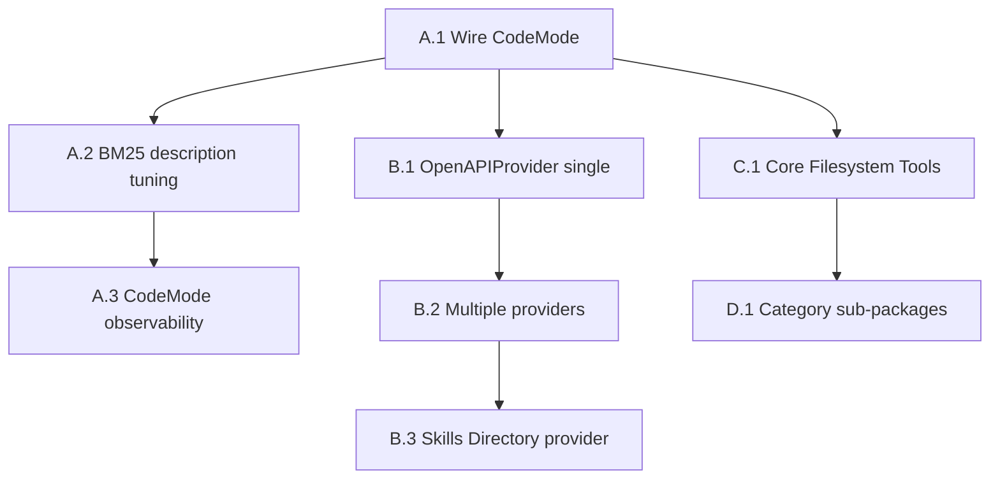

# mem-graph — CodeMode & OpenAPI Provider Plan

**Scope**: Add FastMCP 3.1 CodeMode transform and OpenAPIProvider tool generation  
**Stack**: Python / FastMCP == 3.2.3 [code-mode] / Ladybug (Kuzu) / Ollama  
**Depends on**: Refactor plan Phases 1–3 complete (single write path, cognitive tool surface)

---

## Problem

Two capabilities missing from mem-graph that directly improve AI tool usage quality:

1. **Context window pollution** — as the tool catalog grows, the full list loads into the AI's context upfront on every session. Each tool schema costs tokens before the AI reads a single word of the actual task.
2. **No API ingestion path** — external REST APIs (or mem-graph's own HTTP surface) cannot be consumed as MCP tools without writing adapter boilerplate by hand.
3. **Core Tool Strategy** — Move towards a model where only 1-3 "meta-tools" (discovery, inspection, and execution) are visible to the AI, with all specialized logic handled via server-side code execution.

---

## Phase A — CodeMode Transform

**What it does**: Instead of loading the full tool catalog into context, the AI gets three meta-tools — search tools by query (BM25), inspect a tool's schema, then write and execute a small program that calls the tools it needs. Intermediate results that only exist to feed the next step never hit the context window.

**FastMCP hook**: `CodeMode` is an experimental transform in FastMCP 3.1+, already in your `fastmcp>=3.2.3` dep.

### A.1 — Wire CodeMode into the server

**File**: `src/mem_graph/server.py`

Enable the transform during server construction:

```python
from fastmcp.experimental.transforms.code_mode import CodeMode

mcp = FastMCP(
    "mem-graph",
    lifespan=lifespan,
    transforms=[CodeMode()],
)
```

CodeMode exposes three core meta-tools to the AI caller:
- `search_tools(query)` — BM25 over tool names and descriptions to find specialized tools.
- `inspect_tool(tool_name)` — returns full schema for a specific tool found via search.
- `execute_code(code)` — runs generated Python that calls the real tools.

This "1-2-3" approach ensures that the full catalog is never loaded into context. The AI discovers and uses tools on demand.

**Configuration**:

```python
CodeMode(
    search_result_limit=10,       # max tools returned per search
    executor_timeout_seconds=30,  # cap on code execution time
)
```

**Acceptance criteria**:
- AI session context does not contain the full tool list on startup.
- `search_tools("memory recall")` returns mem-graph memory tools with correct scores.
- A tool call that previously required explicit catalog knowledge works via code generation.
- Existing direct tool calls (non-CodeMode clients) still work — CodeMode is additive, not breaking.

### A.2 — Tune tool descriptions for BM25 discoverability

**File**: All `@mcp.tool` docstrings in `src/mem_graph/tools/` (including newly added `audit.py`, `diagrams.py`, `map.py`, `triage.py`)

CodeMode's search is BM25 over tool names and descriptions. If descriptions are vague, search quality degrades. Each tool description needs:

- **Keyword-rich first sentence** — include the domain nouns an AI would search for.
- **Action verb** — what operation is performed.
- **Data touched** — what kind of data goes in and comes out.

Example — `memory_recall`:
```
Before: "Retrieve relevant past context for the current task."
After:  "Search and retrieve stored memories, past decisions, violations, and session summaries by semantic similarity. Provide a natural language query and optionally scope to a project."
```

This is distinct from the docstring rewrite in the refactor plan (which was about removing internal graph terminology). This pass is about **search signal density** for BM25.

**Acceptance criteria**:
- `search_tools("find past decisions")` ranks `memory_recall` and `decision_search` in top 3.
- `search_tools("store memory")` ranks `memory_store` in position 1.
- `search_tools("audit code")` ranks `audit_package` in position 1.
- `search_tools("generate diagram")` ranks diagramming tools highly.
- `search_tools("triage task")` ranks triage tools highly.
- `search_tools("map knowledge")` ranks mapping tools highly.

### A.3 — CodeMode observability

**File**: `src/mem_graph/logging.py`

Log code execution events separately from normal tool calls:

```python
# on each execute_code invocation
log.info("codegen_execution", code_length=len(code), tools_called=[...], duration_ms=...)
```

This lets you see what code the AI is generating and whether it's discovering the right tools. Useful for tuning descriptions in A.2.

**Acceptance criteria**:
- Each `execute_code` call produces a structured log line with the tools it invoked internally.

---

## Phase B — OpenAPI Provider

**What it does**: Points FastMCP at an OpenAPI spec and generates MCP tools from it automatically — one tool per endpoint, schemas derived from the spec, no adapter boilerplate.

Two use cases for mem-graph:

1. **Expose mem-graph's own HTTP surface as MCP tools** — if you add a REST API layer later, it gets MCP tools for free.
2. **Ingest external APIs** — point at any OpenAPI spec and the AI gets tools to call that API without you writing anything.

### B.1 — OpenAPIProvider for external API ingestion

**File**: `src/mem_graph/providers/openapi.py` (new)

```python
from fastmcp.server.providers.openapi import OpenAPIProvider

def build_openapi_provider(spec_url: str) -> OpenAPIProvider:
    return OpenAPIProvider(
        openapi_url=spec_url,
        base_url=spec_url.rsplit("/", 1)[0],  # derive base from spec URL
        tool_name_prefix="api_",              # namespace generated tools
    )
```

Wire into server via env var:

```python
# src/mem_graph/server.py
_OPENAPI_SPEC = os.getenv("MEM_GRAPH_OPENAPI_SPEC")

if _OPENAPI_SPEC:
    provider = build_openapi_provider(_OPENAPI_SPEC)
    mcp.add_provider(provider)
```

Setting `MEM_GRAPH_OPENAPI_SPEC=https://api.example.com/openapi.json` at startup adds all endpoints from that spec as MCP tools, prefixed `api_`, immediately available to the AI.

**Acceptance criteria**:
- With `MEM_GRAPH_OPENAPI_SPEC` unset, server behaviour is identical to current.
- With a valid spec URL, generated tools appear in `search_tools` results.
- Generated tool names follow `api_<operationId>` pattern.
- Invalid or unreachable spec URL logs a warning and server starts anyway (non-fatal).

### B.2 — Multiple provider support

**File**: `src/mem_graph/server.py`

Support a list of specs via `MEM_GRAPH_OPENAPI_SPECS` (comma-separated URLs):

```python
_OPENAPI_SPECS = [
    s.strip()
    for s in os.getenv("MEM_GRAPH_OPENAPI_SPECS", "").split(",")
    if s.strip()
]

for spec_url in _OPENAPI_SPECS:
    try:
        mcp.add_provider(build_openapi_provider(spec_url))
        log.info("openapi_provider_loaded", spec=spec_url)
    except Exception as e:
        log.warning("openapi_provider_failed", spec=spec_url, error=str(e))
```

**Acceptance criteria**:
- Two specs loaded simultaneously produce non-colliding tool names (prefix differentiates if needed).
- One failed spec does not prevent the other from loading.

### B.3 — Skills Directory Provider for local agent skills

**File**: `src/mem_graph/server.py`

For offline use, regulated environments, or loading local agent skills scripts:

```python
from fastmcp.server.providers.skills import SkillsProvider

mcp.add_provider(SkillsProvider("skills"))
```

Drop any `.py` skill/tool files into the `skills` directory and they're picked up on next start. Hot-reload if FastMCP's provider supports it.

**Acceptance criteria**:
- Skill files in the `skills` directory appear as MCP tools on startup.
- Removing a file and restarting removes the tool.

---

## Phase C — Core Filesystem Tools

**What it does**: Provide base capabilities for the AI to manipulate the local filesystem, enabling autonomous code editing and inspection.

### C.1 — Implement local filesystem tools

**File**: `src/mem_graph/tools/filesystem.py` (pre-refactor)

We will introduce specialized tools for CodeMode execution:
- **`file_search`** / **`file_grep`**: Search for text/patterns across project files.
- **`file_read`**: Read lines of a file.
- **`file_edit`** / **`file_write`**: Surgically modify or create files.
- **`file_delete`**: Remove files safely.

---

## Phase D — Tools Directory Refactoring

**What it does**: The `src/mem_graph/tools/` folder is getting crowded with new agents and tools. We will restructure the flat directory into logical sub-packages.

### D.1 — Category sub-packages

**File**: `src/mem_graph/tools/*` and `src/mem_graph/server.py`

Refactor the tools folder into logical sub-packages:
- `tools/memory/`: `memory.py`, `notes.py`, `conversation.py` (Recall and storage)
- `tools/filesystem/`: `file_search`, `file_read`, `file_edit`, `file_write`, `file_delete` (Core FS access)
- `tools/work/`: `tasks.py`, `decisions.py`, `projects.py`, `violations.py` (Workflows and tracking)
- `tools/agents/`: `audit.py`, `diagrams.py`, `map.py`, `triage.py` (Specialized autonomous agents)

Each sub-package will have an `__init__.py` to facilitate clean imports in `server.py`.

Update `mcp.mount()` imports in `server.py` to reflect the new structure.

---

## Execution Order



A.1 before B.1 because CodeMode's `search_tools` is how the AI discovers OpenAPI-generated tools. Without CodeMode, a large OpenAPI spec dumps all generated tools into context upfront — exactly the problem CodeMode solves.

---

## Files Changed

| File | Action |
|---|---|
| `src/mem_graph/server.py` | Modify — CodeMode transform, provider wiring, env vars, update tool imports |
| `src/mem_graph/providers/openapi.py` | Create — provider builder |
| `src/mem_graph/logging.py` | Modify — codegen execution log events |
| `All tool docstrings` | Modify — BM25 keyword density pass |
| `src/mem_graph/tools/...` | Move — Refactor flat files into categorized sub-packages |

---

## New Environment Variables

| Variable | Default | Description |
|---|---|---|
| `MEM_GRAPH_OPENAPI_SPECS` | `""` | Comma-separated OpenAPI spec URLs to ingest |

---

## What This Does Not Cover

- Writing custom OpenAPI specs for mem-graph's own tools (they're already MCP-native, no spec needed)
- CodeMode in production with untrusted AI callers — code execution is a trust boundary; mem-graph is local-first so this is acceptable, but worth noting
- Per-provider auth headers for external APIs requiring API keys (FastMCP supports this via provider config — defer until a concrete external API is targeted)

---

## 🚨 Security Warning: CVE-2026-32871

The `OpenAPIProvider` in FastMCP 3.x was subject to a critical vulnerability (CVE-2026-32871) involving SSRF and Path Traversal via unencoded path parameters.

**Requirement**: Ensure `fastmcp` is updated to the patched version (v3.2.0+) before deploying `OpenAPIProvider` in any environment where sensitive internal endpoints are accessible. 
**Sandbox**: CodeMode execution requires the `[code-mode]` extra (installed via `uv add fastmcp[code-mode]`) to enable the secure discord-based Python execution sandbox.

### Proactive Mitigations (Defense-in-Depth)

Even with patched versions, local-only servers are vulnerable to **Prompt Injection-based SSRF**. Implement these layers:

1. **Strict Lockfile Pinning**: Use `uv lock` or equivalent to strictly pin `fastmcp==3.2.3`. Verify active version with `pip show fastmcp`.
2. **OpenAPI Spec Sanitization**: Do not ingest raw, auto-generated specs. Create stripped-down versions for the AI that omit `/admin` routes, sensitive data paths, or `DELETE` operations.
3. **Regex Validation**: Enforce strict `pattern` constraints in OpenAPI child schemas for path parameters (e.g., `"pattern": "^[a-zA-Z0-9_-]+$"`). This causes FastMCP to reject traversal characters (`../`, `./`) at the tool-validation layer.
4. **Network Isolation**: Run the MCP server in a Docker container using a bridge network (avoid `--network host`). This prevents the AI from reaching unauthenticated host-local services (Redis, Docker daemon, etc.) via SSRF.
5. **Human-in-the-Loop (HITL)**: Configure the AI client to require manual user approval for all mutating tool calls (`POST`, `PUT`, `DELETE`) and the `execute_code` meta-tool.
