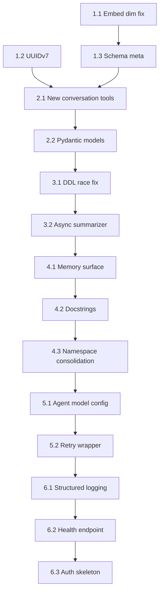

# mem-graph Refactor Plan

**Scope**: Architectural improvements derived from documentation review  
**Stack**: Python / FastMCP 3 / Ladybug (Kuzu) / Ollama  
**Tenets**: Cognitive tool boundaries, single-writer graph paths, async-safe DDL, schema honesty

---

## Problem Summary

Four classes of problems identified across the codebase:

1. **Tool schema is mechanical, not cognitive** — conversation capture exposes CRUD plumbing (22+ tool calls per session) instead of intent-level operations. The AI burns tool call budget on infrastructure.
2. **Blocking DDL inside a tool** — `conversation_end` drops and recreates the vector index synchronously. Concurrent calls will race on graph schema.
3. **Synchronous Ollama summarization** — blocks `conversation_end`; cold Ollama = hung close; fallback degrades to a useless placeholder.
4. **Schema honesty gaps** — `OLLAMA_EMBED_DIM` defaults to `768` but schema declares `FLOAT[1536]`. UUIDs documented as v7 but `uuid.uuid4()` used everywhere.

---

## Phase 1 — Schema & Foundation Fixes

**Solves**: Embedding dimension mismatch, UUID v4/v7 inconsistency, missing `status` field on `conversation_start` response.

### 1.1 — Fix embedding dimension configuration

**File**: `src/mem_graph/embeddings.py`

- Read `OLLAMA_EMBED_DIM` and validate it equals the schema constant at import time.
- Expose a module-level `EMBED_DIM: int` constant used by schema DDL and all node creation paths.
- Raise `RuntimeError` at startup if configured dim does not match the value the schema was initialized with (read from a `schema_meta` node).
- Remove the `768` default — force explicit configuration or use `1536` as the sole default matching the schema.

**Acceptance criteria**:
- Server refuses to start if `OLLAMA_EMBED_DIM` does not match stored schema dimension.
- `embed()` return length asserted against `EMBED_DIM` before any DB write.

### 1.2 — Adopt UUIDv7 throughout

**File**: `src/mem_graph/ids.py` (new)

- Implement `new_id() -> str` returning a UUIDv7 string using `uuid-utils` or a minimal stdlib shim.
- Replace all `str(uuid.uuid4())` calls across `tools/` with `from ..ids import new_id`.
- UUIDv7 is already in the documented data model contract — this closes the gap.

**Acceptance criteria**:
- `grep -r "uuid4()" src/` returns zero results.
- IDs sort lexicographically by creation time.

### 1.3 — Schema meta node

**File**: `schema/agent_memory_schema.cypher`

- Add a `SchemaMeta` node table with `version STRING`, `embed_dim INT64`, `initialized_at TIMESTAMP`.
- Populate on first `init_db()` run.
- `init_db()` reads this node and validates `embed_dim` matches `OLLAMA_EMBED_DIM` env var before running any tool.

**Acceptance criteria**:
- Fresh DB initializes `SchemaMeta` correctly.
- Second startup with mismatched dim raises `RuntimeError` with a clear message.

---

## Phase 2 — Conversation Tool Redesign

**Solves**: 22-call-per-session overhead, blocking DDL, synchronous Ollama summarization, mechanical vs cognitive schema.

### 2.1 — New cognitive tool interface

**File**: `src/mem_graph/tools/conversation.py` (rewrite)

Replace the four-tool CRUD surface with three intent-level tools:

```
memory_capture_session(project_id, agent_name, messages, context?)  →  SessionCaptureResult
memory_recall(query, project_id, budget_tokens, recency_bias?)       →  MemoryRecallResult  
memory_annotate(conversation_id, note, significance?)                →  AnnotateResult
```

**`memory_capture_session`**:
- Accepts the full `messages: list[ConversationMessage]` in one call — agent hands over entire session at close.
- Internally: upsert Agent, create Conversation, bulk-create Message nodes, chain `NEXT_MESSAGE` edges, kick summarization as a **background task** (non-blocking).
- Returns `session_id` and a preliminary summary placeholder immediately.
- No DDL in this path — see Phase 3 for the DDL race fix.

**`memory_recall`**:
- Runs hybrid BM25 + vector search internally.
- Accepts `budget_tokens: int` and fits results to that budget before returning.
- Accepts `recency_bias: float` (0 = pure semantic, 1 = pure recency) for caller control.
- Returns structured context ready to prepend to a prompt, not raw message dumps.

**`memory_annotate`**:
- Mid-session hook for agent to tag something as significant without closing the conversation.
- Creates a `Memory` node linked to the active `Conversation`.

**Acceptance criteria**:
- A complete 20-turn session requires exactly **1 tool call** for capture (not 22).
- `memory_recall` never returns more tokens than `budget_tokens`.
- `conversation_end` is removed from the public tool surface.
- Old `conversation_start` / `conversation_append` / `conversation_get` retained internally as helpers if needed, not exposed as tools.

### 2.2 — Pydantic models for tool I/O

**File**: `src/mem_graph/models/conversation.py` (new)

- `ConversationMessage(role, content, tool_name?)` — input message unit.
- `SessionCaptureResult(session_id, turn_count, summary_pending)` — immediate return from capture.
- `MemoryRecallResult(memories, total_tokens, truncated)` — bounded recall result.
- `AnnotateResult(memory_id, linked_to_session)`.

Using Pydantic models as return types (not bare `dict`) gives FastMCP richer schema generation and gives the AI caller accurate type hints in the tool catalog.

**Acceptance criteria**:
- All three new tools have Pydantic return types, not `-> dict`.
- FastMCP-generated JSON schema for each tool is inspectable and accurate.

---

## Phase 3 — DDL Race Elimination

**Solves**: `conversation_end` drop-recreate vector index race under concurrent calls.

### 3.1 — Dedicated index writer

**File**: `src/mem_graph/db.py`

- Add `update_node_embedding(table, node_id, embedding, index_name)` as a DB-layer function.
- This function acquires a per-table `asyncio.Lock` before doing the drop/SET/recreate sequence.
- No tool ever calls `DROP_VECTOR_INDEX` directly — all embedding writes go through this function.

**Implementation sketch**:
```python
_index_locks: dict[str, asyncio.Lock] = {}

async def update_node_embedding(table: str, node_id: str, vec: list[float], index: str) -> None:
    lock = _index_locks.setdefault(table, asyncio.Lock())
    async with lock:
        conn.execute(f"CALL DROP_VECTOR_INDEX('{table}', '{index}');")
        conn.execute(f"MATCH (n:{table} {{id: $id}}) SET n.embedding = $vec", ...)
        conn.execute(f"CALL CREATE_VECTOR_INDEX('{table}', '{index}', 'embedding', metric := 'cosine');")
```

**Acceptance criteria**:
- `grep -r "DROP_VECTOR_INDEX" src/mem_graph/tools/` returns zero results.
- Concurrent `memory_capture_session` calls do not corrupt the Conversation index.

### 3.2 — Async background summarization

**File**: `src/mem_graph/services/summarizer.py` (new)

- `enqueue_summary(conversation_id, transcript)` — adds to an `asyncio.Queue`.
- Background worker loop: dequeues, calls Ollama, calls `update_node_embedding` for the Conversation summary.
- On Ollama failure: exponential backoff up to 3 retries, then stores `"[summary pending — Ollama unavailable]"` with a `summary_status: str` field rather than silently discarding.
- Worker started in `server.py` lifespan, shut down cleanly on exit.

**Acceptance criteria**:
- `memory_capture_session` returns in < 50ms regardless of Ollama cold-start time.
- Failed summaries are retried; final failure writes a meaningful status, not a char-count placeholder.
- Worker shutdown drains the queue before process exit.

---

## Phase 4 — Tool Catalog Rationalization

**Solves**: Context window token pressure from large tool catalog, poor tool discoverability.

### 4.1 — Reduce memory tool surface to 5 cognitive tools

**File**: `src/mem_graph/tools/memory.py`

Current surface has `memory_store`, `memory_recall`, `memory_search`, `memory_expire`, `memory_list` as separately visible tools. Consolidate:

| Keep as tool | Move to internal helper |
|---|---|
| `memory_store` | — |
| `memory_recall` | — |
| `memory_search` | → merge into `memory_recall` with `cross_scope=True` param |
| `memory_expire` | → `memory_manage(action="expire", id=...)` |
| `memory_list` | → `memory_manage(action="list", scope=...)` |

New surface: `memory_store`, `memory_recall`, `memory_manage`.

**Acceptance criteria**:
- Memory namespace exposes 3 tools instead of 5.
- `memory_recall` accepts `cross_scope: bool = False` to replace `memory_search` behaviour.

### 4.2 — Descriptions rewritten for LLM consumption

**File**: All `@mcp.tool` docstrings in `src/mem_graph/tools/`

Current docstrings describe *implementation* ("Creates a Conversation node, an Agent node (if not existing), and links them"). Rewrite all docstrings to describe *intent and when to call*:

Rules:
- First sentence: what the agent should use this tool to *accomplish*.
- Second sentence: what the agent must *provide*.
- Third sentence: what the agent *gets back* and can do with it.
- No mention of internal graph structures, node types, or Cypher.

Example (before):
> "Creates a Conversation node, an Agent node (if not existing), and links them. Returns the conversation_id that must be passed to all subsequent calls."

Example (after):
> "Open a new conversation session to begin tracking this work. Provide the owning project, your agent name, and model string. Returns a session_id to pass to memory_capture_session when the session ends."

**Acceptance criteria**:
- Zero mentions of "node", "Cypher", "MERGE", "CREATE", "link" in any public tool docstring.

### 4.3 — Namespace consolidation

**File**: `src/mem_graph/server.py`

Current lazy namespaces: `conversation`, `decision`, `task`, `project`, `memory`, `note`, `violation`, `audit` — 8 namespaces.

After Phase 2, `conversation` namespace is eliminated (merged into `memory`). Consolidate to:

| New namespace | Contains |
|---|---|
| `memory` | memory_store, memory_recall, memory_manage, memory_capture_session, memory_annotate |
| `work` | task_*, decision_*, project_*, violation_* |
| `notes` | note_* |
| `audit` | audit_package |

4 namespaces instead of 8. Reduces `tools_activate` round-trips and the namespace discovery overhead.

**Acceptance criteria**:
- `tools_activate(namespace="conversation")` returns a deprecation notice pointing to `memory`.
- `tools_search` returns accurate namespace labels for all tools.

---

## Phase 5 — Agent Pattern Improvements

**Solves**: Hardcoded OpenAI model, no retry in agent tools, layered interaction complexity.

### 5.1 — Configurable agent model

**File**: `src/mem_graph/agents/audit_agent.py`

- Replace hardcoded `'openai:gpt-4o'` with `MEM_GRAPH_AGENT_MODEL` env var.
- Default: `'openai:gpt-4o'` (preserves current behaviour).
- Document in `configuration.md` and `.env.example`.

```python
_AGENT_MODEL = os.getenv("MEM_GRAPH_AGENT_MODEL", "openai:gpt-4o")
audit_agent = Agent(_AGENT_MODEL, deps_type=AuditDependencies, result_type=AuditOutput)
```

**Acceptance criteria**:
- `MEM_GRAPH_AGENT_MODEL=anthropic:claude-sonnet-4-6` works without code changes.
- Config doc updated.

### 5.2 — Retry wrapper for agent tool calls

**File**: `src/mem_graph/agents/audit_agent.py`

- Wrap `update_guide` and `update_registry` tool calls with a simple retry decorator (max 3, exponential backoff).
- Log retried attempts to stderr with attempt count and error.
- Return structured error on final failure rather than string `"Error: ..."`.

**Acceptance criteria**:
- Transient DB errors during audit are retried automatically.
- Audit result clearly distinguishes partial success (some updates failed) from total failure.

---

## Phase 6 — Observability & Security Baseline

**Solves**: No structured logging, no auth, no audit trail, no health endpoint.

### 6.1 — Structured logging

**File**: `src/mem_graph/logging.py` (new)

- Configure `structlog` or stdlib `logging` with JSON output.
- Log every tool invocation: tool name, duration ms, success/error.
- Log every DB operation that modifies state: node type, operation, node_id.
- Replace all `print(..., file=sys.stderr)` in `server.py` with structured log calls.

**Acceptance criteria**:
- `grep -r "print(" src/mem_graph/` returns zero results after migration.
- Each tool call produces a structured log line with `tool`, `duration_ms`, `status`.

### 6.2 — Health endpoint

**File**: `src/mem_graph/server.py`

- Add `GET /health` returning `{"status": "ok", "db": "connected", "ollama": "available"}`.
- Check DB with a cheap `MATCH (n:SchemaMeta) RETURN n LIMIT 1`.
- Check Ollama with a HEAD request to `http://localhost:11434`.
- Return `503` if either dependency is unhealthy.

**Acceptance criteria**:
- `curl http://localhost:9100/health` returns 200 when healthy.
- Returns 503 with degraded component identified when DB or Ollama is down.

### 6.3 — API key authentication skeleton

**File**: `src/mem_graph/auth.py` (new)

- Implement `verify_api_key(key: str) -> bool` reading allowed keys from `MEM_GRAPH_API_KEYS` env var (comma-separated).
- If `MEM_GRAPH_API_KEYS` is unset, authentication is disabled (preserves current local-only behaviour).
- Wire into FastMCP middleware when env var is set.
- Document clearly that this is transport-level only and is not a substitute for network isolation.

**Acceptance criteria**:
- With `MEM_GRAPH_API_KEYS` unset, server behaviour is identical to current.
- With `MEM_GRAPH_API_KEYS=abc123`, unauthenticated requests receive 401.

---

## Execution Order



Phases 1–3 are load-bearing and must be done in order. Phases 4–6 are independent of each other once Phase 3 is complete and can be parallelized.

---

## Files Changed Summary

| File | Action |
|---|---|
| `src/mem_graph/ids.py` | Create — UUIDv7 |
| `src/mem_graph/embeddings.py` | Modify — dim validation, `EMBED_DIM` constant |
| `src/mem_graph/db.py` | Modify — `update_node_embedding`, index locks |
| `src/mem_graph/models/conversation.py` | Create — Pydantic I/O models |
| `src/mem_graph/services/summarizer.py` | Create — async background summarizer |
| `src/mem_graph/tools/conversation.py` | Rewrite — 4 CRUD tools → 3 cognitive tools |
| `src/mem_graph/tools/memory.py` | Modify — consolidate to 3 tools |
| `src/mem_graph/agents/audit_agent.py` | Modify — configurable model, retry wrapper |
| `src/mem_graph/server.py` | Modify — namespace consolidation, health endpoint, logging, auth |
| `src/mem_graph/logging.py` | Create — structured logging config |
| `src/mem_graph/auth.py` | Create — API key skeleton |
| `schema/agent_memory_schema.cypher` | Modify — `SchemaMeta` node table |
| `All tool docstrings` | Modify — LLM-oriented rewrite |
| `.env.example` | Create/update — document all vars including new ones |

---

## What Is Explicitly Out of Scope

- Replacing Ladybug with Neo4j (scaling concern, not correctness)
- Horizontal scaling / Redis session storage
- Full OAuth2/WorkOS integration (auth skeleton in Phase 6 is the right stopping point for now)
- HTTPS/TLS termination (belongs at infra level, not app level)
- Pydantic AI agent replacement (audit agent pattern is sound, just needs config flexibility)
